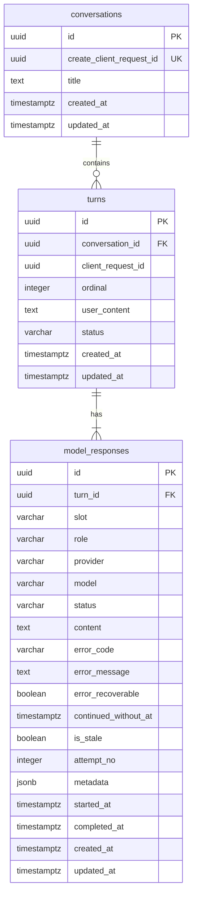

# Data Model: ModelFuse Conversations

## Overview

Una conversación contiene turnos ordenados. Cada turno guarda el prompt una vez y
exactamente cuatro slots: `openai`, `google`, `minimax` y `qwen`. PostgreSQL
conserva historial, idempotencia y exclusión de trabajo por conversación.



UUIDs se generan en frontend para `clientRequestId` y en backend para IDs de
entidad usando `crypto.randomUUID()`; no se requiere extensión PostgreSQL.

## conversations

| Field                      | Type          | Rules                                                                            |
| -------------------------- | ------------- | -------------------------------------------------------------------------------- |
| `id`                       | `uuid`        | PK                                                                               |
| `create_client_request_id` | `uuid`        | Requerido, único global                                                          |
| `title`                    | `text`        | Trim, 1–80 grapheme clusters Unicode validados por backend; persistencia literal |
| `created_at`               | `timestamptz` | Requerido, default `now()`                                                       |
| `updated_at`               | `timestamptz` | Requerido                                                                        |

Indexes:

- `UNIQUE (create_client_request_id)` para replay de `POST /conversations`.
- `(updated_at DESC, id DESC)` para el sidebar.

Lifecycle:

- Se crea únicamente junto con un primer turno válido.
- El título inicial aplica `trim` y toma los primeros 80 grapheme clusters
  Unicode completos mediante la misma segmentación usada por Rename.
- Repetir `create_client_request_id` devuelve esta conversación y su primer turno.
- Reutilizarlo con un prompt distinto produce `CLIENT_REQUEST_ID_CONFLICT`.
- Rename aplica `trim`, valida 1–80 grapheme clusters Unicode, persiste el texto
  resultante literalmente y actualiza `updated_at`.
- Delete bloquea brevemente la conversación, rechaza con `CONVERSATION_BUSY` si
  cualquier turno/slot está `pending`/`running` y, en caso contrario, hace
  cascade a turnos/respuestas.
- Una conversación vacía nueva es estado frontend; no inserta fila.

`has_work_in_progress` no se persiste: se deriva consultando turnos y slots
`pending`/`running`.

## turns

| Field               | Type          | Rules                                                  |
| ------------------- | ------------- | ------------------------------------------------------ |
| `id`                | `uuid`        | PK                                                     |
| `conversation_id`   | `uuid`        | FK → conversations, `ON DELETE CASCADE`                |
| `client_request_id` | `uuid`        | Requerido                                              |
| `ordinal`           | `integer`     | Mayor que 0                                            |
| `user_content`      | `text`        | Trim, al menos un carácter                             |
| `status`            | `varchar(16)` | `pending`, `running`, `partial`, `completed`, `failed` |
| `created_at`        | `timestamptz` | Requerido                                              |
| `updated_at`        | `timestamptz` | Requerido                                              |

Constraints/indexes:

- `UNIQUE (conversation_id, client_request_id)` para replay idempotente.
- `UNIQUE (conversation_id, ordinal)` para orden.
- `UNIQUE (conversation_id) WHERE status IN ('pending','running')` para un único
  turno con trabajo en curso.
- Check de status.
- `(conversation_id, ordinal DESC, id DESC)` para historial.

El primer turno usa el mismo UUID que
`conversations.create_client_request_id`. En replay, backend consulta el ID antes
del busy check y devuelve la fila existente.

### Creation transaction

Para un turno posterior:

1. bloquear brevemente la conversación;
2. consultar `(conversation_id, client_request_id)`;
3. si existe, devolverlo sin insertar ni ejecutar providers;
   si el prompt es distinto, devolver `CLIENT_REQUEST_ID_CONFLICT`;
4. consultar cualquier turno o slot `pending`/`running`;
5. si existe, terminar con `CONVERSATION_BUSY`;
6. calcular ordinal, insertar turno y cuatro slots;
7. confirmar y liberar el lock antes de orquestar.

### State transitions

```text
pending -> running -> completed
                   -> partial
                   -> failed

partial -> running -> completed
                   -> partial
```

Un retry puede llevar el mismo turno terminal a `running`. El estado se recalcula
en la misma transacción que el slot:

- `running`: cualquier slot `pending`/`running`;
- `completed`: cuatro slots completados vigentes;
- `partial`: ningún slot activo, existe contenido útil y falta/falló algún slot;
- `failed`: ningún slot activo y no existe contenido útil.

Así, todo slot activo implica un turno `running`, y el índice parcial sigue
representando la política de un turno activo.

## model_responses

| Field                  | Type           | Rules                                                        |
| ---------------------- | -------------- | ------------------------------------------------------------ |
| `id`                   | `uuid`         | PK                                                           |
| `turn_id`              | `uuid`         | FK → turns, `ON DELETE CASCADE`                              |
| `slot`                 | `varchar(16)`  | `openai`, `google`, `minimax`, `qwen`                        |
| `role`                 | `varchar(16)`  | `base` o `consolidator`, consistente con slot                |
| `provider`             | `varchar(64)`  | Identificador normalizado                                    |
| `model`                | `varchar(128)` | Modelo configurado                                           |
| `status`               | `varchar(16)`  | `pending`, `running`, `completed`, `failed`                  |
| `content`              | `text`         | Contenido normalizado; requerido para `completed`            |
| `error_code`           | `varchar(64)`  | Código seguro                                                |
| `error_message`        | `text`         | Mensaje seguro                                               |
| `error_recoverable`    | `boolean`      | Derivado de la clasificación canónica; habilita Retry manual |
| `continued_without_at` | `timestamptz`  | Decisión persistida; solo base fallido                       |
| `is_stale`             | `boolean`      | Consolidación Qwen obsoleta durante reemplazo                |
| `attempt_no`           | `integer`      | Default 0; incrementa al aceptar cada ejecución              |
| `metadata`             | `jsonb`        | Duración/evidencia contextual segura                         |
| `started_at`           | `timestamptz`  | Nullable                                                     |
| `completed_at`         | `timestamptz`  | Nullable                                                     |
| `created_at`           | `timestamptz`  | Requerido                                                    |
| `updated_at`           | `timestamptz`  | Requerido                                                    |

Constraints/indexes:

- `UNIQUE (turn_id, slot)`.
- Checks de slot, rol y estado.
- `completed` exige contenido no vacío.
- `failed` exige `error_code`.
- `continued_without_at` solo existe en base `failed`.
- `is_stale=true` solo existe en Qwen con contenido previo.
- índice parcial por `status IN ('pending','running')` para busy/recovery.

### Base transitions

```text
pending -> running -> completed
                   -> failed
failed  -> pending -> running -> completed
                             -> failed
```

Una falla no transiciona automáticamente a `pending`. La UI recibe inmediatamente
el fallo y acciones. Continue-without establece `continued_without_at` sin cambiar
a estado activo ni invocar providers; la marca es irreversible en v1 y hace que
ese slot deje de ser elegible para retry.

### Retry exclusion

Retry usa un update condicional:

```sql
UPDATE model_responses
SET status = 'pending',
    attempt_no = attempt_no + 1,
    ...
WHERE id = :response_id
  AND status = 'failed'
  AND error_recoverable = true
  AND continued_without_at IS NULL;
```

Una sola request modifica la fila. Si no modifica ninguna y el slot está
`pending`/`running`, la API devuelve `RESPONSE_RETRY_IN_PROGRESS`. No se necesita
tabla de retries ni mutex en memoria. Si no está activo pero no satisface todos
los predicados, incluida la ausencia de Continue-without, devuelve
`RESPONSE_NOT_RETRYABLE`.

Antes de llevar un turno terminal a `running`, la transacción bloquea la
conversación y comprueba que no exista otro turno activo. Si existe uno distinto,
devuelve `CONVERSATION_BUSY`. Trabajo ya activo dentro del mismo turno no viola el
límite de un turno, aunque la UI igualmente deshabilita todos los retries mientras
busy sea true.

El orquestador conserva el `attempt_no` aceptado y persiste completion/error con
`WHERE id=:response_id AND attempt_no=:attempt_no`. Un resultado tardío de una
ejecución anterior no sobrescribe un retry o reconsolidación posterior.

### Qwen refresh

```text
completed/is_stale=false
    -> running/is_stale=true
    -> completed/is_stale=false
    -> failed/is_stale=true
```

Retry base fallido no cambia Qwen. Retry base exitoso marca stale y ejecuta una
nueva consolidación. Si Qwen falla, se aplica FR-011 y stale no se proyecta como
consolidación vigente.

## Work-in-progress Projection

La consulta canónica es equivalente a:

```sql
EXISTS (
  SELECT 1 FROM turns
  WHERE conversation_id = :id
    AND status IN ('pending','running')
)
OR EXISTS (
  SELECT 1
  FROM model_responses mr
  JOIN turns t ON t.id = mr.turn_id
  WHERE t.conversation_id = :id
    AND mr.status IN ('pending','running')
)
```

`ConversationSummary` y `ConversationDetail` proyectan el booleano
`hasWorkInProgress`. Un slot/turno `failed`, `partial` o `completed` no cuenta como
trabajo. Cada commit que pueda cambiarlo produce además un `busy_update`
explícito; frontend no lo deduce de `turn_update`.

## SSE Projections

SSE no agrega entidades ni persistencia. El endpoint por turno emite snapshots
normalizados derivados del modelo vigente:

- `slot_update`: `conversationId`, `turnId`, slot, status canónico, resultado/error
  cuando exista, `attemptNo`, `updatedAt` y un `runtimeStage` opcional;
- `turn_update`: IDs, status agregado y `updatedAt`;
- `busy_update`: IDs y `hasWorkInProgress` calculado.

`runtimeStage` es efímero (“pensando”, “analizando contexto”, “consolidando”);
nunca se escribe en `model_responses.status`. Los demás campos representan estado
PostgreSQL ya confirmado. El snapshot inicial de una conexión nueva usa estas
mismas proyecciones, por lo que no se almacenan eventos ni se añade replay durable.

## Context Evidence

`metadata.contextWindow` persiste únicamente:

```json
{
  "truncated": true,
  "firstIncludedOrdinal": 8,
  "lastIncludedOrdinal": 15,
  "protectionApplied": "turn-window-and-truncate"
}
```

No persiste el prompt compuesto, mensajes seleccionados, estimaciones, límites ni
otra copia de contenido. La API proyecta la evidencia y la UI comunica el
truncamiento/protección. Los campos no representan presupuesto ni contabilidad de
tokens por modelo.

### Technical token protection

`ContextBuilder` recibe desde configuración el límite técnico del deployment y
`LLM_CONTEXT_THRESHOLD_RATIO`, default `0.8`. Después de construir la ventana:

1. mide el payload por slot/deployment mediante un contador exacto compatible o
   una cota superior conservadora demostrable que incluya el envelope;
2. elimina turnos completos desde el más antiguo hasta alcanzar el umbral;
3. si aún no cabe, recorta contenido contextual auxiliar preservando roles,
   etiquetas y prompt actual;
4. vuelve a estimar después de cada cambio;
5. si el payload mínimo válido excede el umbral, no llama al adapter y falla solo
   el slot con `INVALID_PROMPT_SIZE`.

La medición no puede subestimar. Sus pruebas cubren ASCII, puntuación, Unicode,
emoji, scripts no latinos y contenido fragmentado/con delimitadores, comparando
contra el conteo real o tokenizer de referencia cuando exista. Es efímera:
PostgreSQL conserva el historial completo y el esquema no agrega columnas de
tokens, presupuestos ni contexto compuesto.

### Base query

Selecciona una ventana de turnos recientes y une solo respuestas completadas del
mismo slot:

```text
user(prompt 1) -> assistant(base response 1) -> ... -> user(current prompt)
```

### Qwen query

Selecciona prompts/consolidaciones Qwen previas vigentes, añade prompt actual y
respuestas base completadas del turno actual, más etiquetas de ausencia actuales.
Nunca une respuestas base de turnos anteriores. Un slot con
`continued_without_at` se representa como ausencia permanente y no vuelve a
incorporarse en una reconsolidación del turno.

## Recovery

Al iniciar sobre la misma DB:

1. seleccionar slots `pending`/`running`;
2. cambiarlos a `failed/interrupted`, mensaje seguro y `error_recoverable=true`;
3. recalcular turnos afectados;
4. recalcular busy derivado;
5. mantener orden, atribución, contenido y consulta/retry.

Recovery no crea turnos ni relanza providers. Su aceptación exige los invariantes
en el 100% de casos del conjunto versionado de recuperación.

## API Projections

- `ConversationSummary`: id, title, timestamps, hasWorkInProgress.
- `ConversationDetail`: mismos metadatos, sin cargar turnos.
- `ConversationPage`: items, nextCursor.
- `TurnPage`: hasta tres turnos completos, olderCursor, hasOlder.
- `Turn`: id, clientRequestId, ordinal, prompt, status, cuatro responses,
  timestamps.
- `ModelResponse`: slot, role, provider/model, status, content/error,
  recoverable, continuedWithout, stale, contextWindow, timestamps y metadata.
- `SlotUpdate`, `TurnUpdate` y `BusyUpdate`: proyecciones SSE efímeras de las filas
  y del busy derivado; no son entidades persistidas.

No se proyectan credenciales, bodies externos, contexto compuesto ni errores
crudos.

## Cursors

### Sidebar

- Cursor opaco `{updatedAt,id}`.
- Orden `(updated_at,id) DESC`.
- Tamaño `CONVERSATION_SIDEBAR_PAGE_SIZE`.

### Turn history

- Primera consulta: tres ordinales más altos.
- Cursor opaco `{ordinal,id}` del más antiguo devuelto.
- Bloques previos de hasta tres turnos completos.
- Items en orden cronológico; prompt y slots nunca se separan.

## Liquibase Modules

`conversations` crea `conversations`/`turns`, incluidos constraints de
idempotencia y turno activo. `messages` crea `model_responses`, checks e índices.
Los XML se incluyen desde `db/changelogs/db.changelog-master.xml`.

No se crean tablas de idempotencia, locks, contexto, evaluación, ranking,
métricas, retries ni versiones de respuesta. `attempt_no` protege la fila vigente;
no almacena un historial de intentos.
