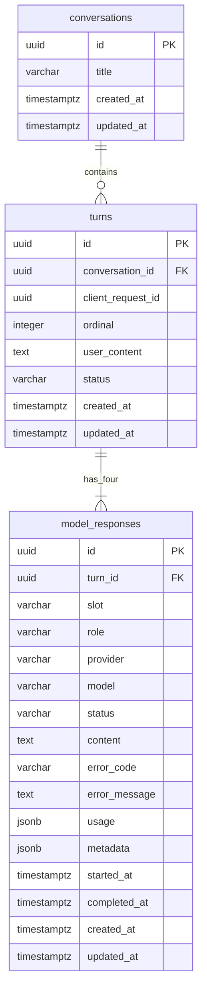

# Data Model: ModelFuse Conversations

## Overview

Una conversación contiene turnos ordenados. Cada turno guarda el prompt una sola
vez y exactamente cuatro slots de respuesta. Los historiales lógicos se derivan
por slot; no se duplican conversaciones ni prompts.



IDs se generan en Node con `crypto.randomUUID()` para no introducir una extensión
PostgreSQL.

## conversations

| Field | Type | Rules |
|---|---|---|
| `id` | `uuid` | PK |
| `title` | `varchar(80)` | 1–80 caracteres después de trim |
| `created_at` | `timestamptz` | requerido, default `now()` |
| `updated_at` | `timestamptz` | requerido, actualizado en la misma transacción que el turno/rename |

Indexes:

- `(updated_at DESC, id DESC)` para paginación estable del sidebar.

Lifecycle:

- Se crea únicamente junto con el primer turno.
- Rename modifica `title` y `updated_at`.
- Delete es físico y hace cascade a turnos/respuestas después de confirmación en
  UI.

## turns

| Field | Type | Rules |
|---|---|---|
| `id` | `uuid` | PK |
| `conversation_id` | `uuid` | FK → conversations, `ON DELETE CASCADE` |
| `client_request_id` | `uuid` | requerido; idempotencia del cliente |
| `ordinal` | `integer` | mayor que 0 |
| `user_content` | `text` | trim, al menos un carácter |
| `status` | `varchar(16)` | check: `pending`, `running`, `partial`, `completed`, `failed` |
| `created_at` | `timestamptz` | requerido |
| `updated_at` | `timestamptz` | requerido |

Constraints:

- `UNIQUE (conversation_id, ordinal)`
- `UNIQUE (conversation_id, client_request_id)`
- Index `(conversation_id, ordinal DESC, id DESC)` para bloques de historial
  anteriores.

State transitions:

```text
pending -> running -> completed
                   -> partial
                   -> failed
```

- `completed`: los cuatro slots completaron.
- `partial`: existe contenido útil pero al menos un slot falló.
- `failed`: ningún resultado útil pudo producirse.
- Solo se permite un turno no terminal por conversación.

## model_responses

| Field | Type | Rules |
|---|---|---|
| `id` | `uuid` | PK |
| `turn_id` | `uuid` | FK → turns, `ON DELETE CASCADE` |
| `slot` | `varchar(16)` | `base-1`, `base-2`, `base-3`, `consolidator` |
| `role` | `varchar(16)` | `base` o `consolidator`; consistente con slot |
| `provider` | `varchar(64)` | identificador normalizado, sin credenciales |
| `model` | `varchar(128)` | nombre configurado |
| `status` | `varchar(16)` | `pending`, `running`, `completed`, `failed` |
| `content` | `text` | requerido solo cuando `completed` |
| `error_code` | `varchar(64)` | código estable y sanitizado |
| `error_message` | `text` | mensaje seguro para usuario |
| `usage` | `jsonb` | default `{}`; input/output/total tokens y costo cuando existan |
| `metadata` | `jsonb` | default `{}`; latencia y campos no sensibles |
| `started_at` | `timestamptz` | nullable |
| `completed_at` | `timestamptz` | nullable |
| `created_at` | `timestamptz` | requerido |
| `updated_at` | `timestamptz` | requerido |

Constraints and indexes:

- `UNIQUE (turn_id, slot)` garantiza cuatro posiciones sin duplicados.
- Index `(turn_id, slot)` queda cubierto por el unique.
- Index parcial por `status` para localizar ejecuciones activas/interrumpidas.
- Checks aseguran que `completed` tenga contenido y `failed` tenga error code.

State transitions:

```text
pending -> running -> completed
                   -> failed
failed  -> pending   (retry explícito)
```

Un retry de base invalida el resultado consolidado existente: el slot
`consolidator` vuelve a `pending` y se recalcula después del base.

## Context Queries

### Base slot

Selecciona los últimos N turnos completados de la conversación y une únicamente
la respuesta del mismo `slot`. Produce:

```text
user(prompt 1) -> assistant(base-N response 1) -> ... -> user(current prompt)
```

### Consolidator

Selecciona prompts y respuestas con slot `consolidator` de turnos previos y añade
las respuestas base completadas del turno actual. Nunca une historiales base
previos.

## Conversation API Projection

La API devuelve:

- `ConversationSummary`: id, title, createdAt, updatedAt.
- `ConversationDetail`: metadatos sin historial embebido.
- `TurnPage`: hasta tres turnos completos en orden cronológico, `olderCursor` y
  `hasOlder`.
- `Turn`: id, ordinal, prompt, status, timestamps y `responses[]`.
- `ModelResponse`: slot, role, provider, model, status, content/error, timestamps,
  usage y metadata.

La proyección omite claves, configuración interna y errores crudos.

## History Cursors

- La primera consulta no envía cursor y selecciona los tres ordinales más altos.
- El cursor es Base64URL opaco de `{ordinal,id}` correspondiente al turno más
  antiguo del bloque devuelto.
- La siguiente consulta filtra `(ordinal,id) < (cursor.ordinal,cursor.id)`, toma
  hasta tres filas descendentes y las devuelve en orden cronológico.
- Un cursor inválido o perteneciente a otra conversación produce error de
  validación; no se reutiliza silenciosamente.
- El cursor no requiere columna nueva ni estado de sesión en servidor.

## Liquibase Modules

`conversations` crea `conversations` y `turns`. `messages` crea
`model_responses` e índices asociados. Cada SQL es formateado, tiene changeset
único y rollback seguro. `db.changelog-master.xml` incluye ambos XML de módulo.

No se crea tabla de resúmenes ni módulo de métricas en v1. Si se activa resumen
persistido, pertenece al módulo `conversations`; un esquema analítico separado se
creará en `metrics` solo cuando ranking/dashboard sea parte de un spec.
