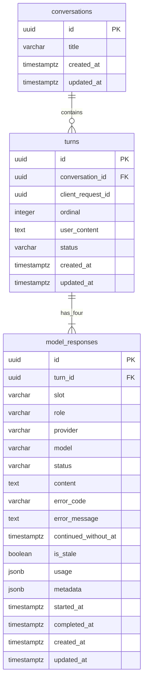

# Data Model: ModelFuse Conversations

## Overview

Una conversación contiene turnos ordenados. Cada turno guarda el prompt una vez y
exactamente cuatro slots: `openai`, `google`, `minimax` y `qwen`. Los contextos se
derivan por slot desde PostgreSQL; no se duplican conversaciones.



Los UUID se generan en Node con `crypto.randomUUID()`; no se añade una extensión
PostgreSQL.

## conversations

| Field | Type | Rules |
|---|---|---|
| `id` | `uuid` | PK |
| `title` | `varchar(80)` | Trim, 1–80 caracteres |
| `created_at` | `timestamptz` | Requerido, default `now()` |
| `updated_at` | `timestamptz` | Requerido |

Indexes:

- `(updated_at DESC, id DESC)` para el cursor del sidebar.

Lifecycle:

- Se crea únicamente junto con el primer turno.
- El título inicial es `prompt.trim().slice(0, 80)`.
- Rename aplica trim, acepta cualquier texto y actualiza `updated_at`.
- Delete es físico y hace cascade a turnos/respuestas.

## turns

| Field | Type | Rules |
|---|---|---|
| `id` | `uuid` | PK |
| `conversation_id` | `uuid` | FK → conversations, `ON DELETE CASCADE` |
| `client_request_id` | `uuid` | Requerido; idempotencia |
| `ordinal` | `integer` | Mayor que 0 |
| `user_content` | `text` | Trim, al menos un carácter |
| `status` | `varchar(16)` | `pending`, `running`, `partial`, `completed`, `failed` |
| `created_at` | `timestamptz` | Requerido |
| `updated_at` | `timestamptz` | Requerido |

Constraints:

- `UNIQUE (conversation_id, ordinal)`
- `UNIQUE (client_request_id)` para idempotencia global de requests creados por el
  cliente.
- Check de status.
- Index `(conversation_id, ordinal DESC, id DESC)` para historial.

State transitions:

```text
pending -> running -> completed
                   -> partial
                   -> failed

partial -> running -> completed
                   -> partial
```

Un retry puede devolver un turno terminal a `running`. El estado se recalcula
después de cada cambio:

- `completed`: cuatro slots completados y Qwen no está stale.
- `partial`: existe contenido útil, pero falta/está fallido algún slot o Qwen está
  stale.
- `failed`: no existe contenido útil.

Solo se crea un nuevo turno cuando el anterior no está ejecutándose. La exclusión
se implementa con row lock de conversación dentro de la transacción del service,
no mediante memoria del proceso.

## model_responses

| Field | Type | Rules |
|---|---|---|
| `id` | `uuid` | PK |
| `turn_id` | `uuid` | FK → turns, `ON DELETE CASCADE` |
| `slot` | `varchar(16)` | `openai`, `google`, `minimax`, `qwen` |
| `role` | `varchar(16)` | `base` o `consolidator`, consistente con slot |
| `provider` | `varchar(64)` | Identificador normalizado |
| `model` | `varchar(128)` | Modelo configurado |
| `status` | `varchar(16)` | `pending`, `running`, `completed`, `failed` |
| `content` | `text` | Contenido exitoso o último contenido Qwen conservado |
| `error_code` | `varchar(64)` | Código seguro y estable |
| `error_message` | `text` | Mensaje seguro para usuario |
| `continued_without_at` | `timestamptz` | Decisión persistida; solo base fallido |
| `is_stale` | `boolean` | Default `false`; solo Qwen con contenido previo |
| `usage` | `jsonb` | Default `{}`; solo datos informados por proveedor |
| `metadata` | `jsonb` | Default `{}`; sin contenido ni secretos |
| `started_at` | `timestamptz` | Nullable |
| `completed_at` | `timestamptz` | Nullable |
| `created_at` | `timestamptz` | Requerido |
| `updated_at` | `timestamptz` | Requerido |

Constraints:

- `UNIQUE (turn_id, slot)`.
- `completed` exige contenido no vacío.
- `failed` exige `error_code`.
- `continued_without_at` solo puede existir en slots base con status `failed`.
- `is_stale=true` solo puede existir en `qwen` con contenido no vacío.
- Index parcial por `status IN ('pending','running')` para recovery.

Base state transitions:

```text
pending -> running -> completed
                   -> failed
failed  -> pending -> running -> completed
                             -> failed
```

Continue-without no cambia `failed`; establece `continued_without_at`. Un retry
exitoso limpia esa marca.

Qwen refresh:

```text
completed/is_stale=false
    -> completed/is_stale=true
    -> running/is_stale=true
    -> completed/is_stale=false  (reemplaza contenido)
    -> failed/is_stale=true      (conserva contenido previo)
```

Si un retry base vuelve a fallar, Qwen no cambia de estado.

## Context Queries

### Base slot

Selecciona hasta `CONVERSATION_CONTEXT_MAX_TURNS` turnos recientes y une
únicamente la respuesta completada del mismo slot:

```text
user(prompt 1) -> assistant(base response 1) -> ... -> user(current prompt)
```

Una respuesta ausente no introduce contenido assistant inventado.

### Qwen

Selecciona prompts y respuestas Qwen previas, añade el prompt actual y las
respuestas base completadas del turno actual. Añade etiquetas de ausencia para
slots fallidos. Nunca une respuestas base de turnos previos.

La consulta devuelve los ordinales incluidos. `ContextBuilder` registra esos
ordinales y `contextTruncated` en metadata de la respuesta, sin persistir otra
copia del contexto.

## Recovery

Al iniciar sobre la misma base:

1. Seleccionar respuestas `pending` o `running`.
2. Cambiarlas a `failed`, `error_code='interrupted'` y mensaje seguro.
3. Recalcular el turno según el contenido útil restante.
4. Mantener todos los slots consultables y reintentables.

Recovery no crea turnos ni relanza proveedores.

## API Projections

- `ConversationSummary`: id, title, createdAt, updatedAt.
- `ConversationDetail`: los mismos metadatos, sin turnos.
- `ConversationPage`: items, nextCursor.
- `TurnPage`: hasta tres turnos completos, olderCursor, hasOlder.
- `Turn`: id, ordinal, prompt, status, responses, timestamps.
- `ModelResponse`: slot, role, provider, model, status, content/error,
  continuedWithout, isStale, timestamps, usage y metadata.

La proyección omite claves, configuración y errores externos crudos.

## Cursors

### Sidebar

- Cursor Base64URL de `{updatedAt,id}`.
- Orden `(updated_at,id) DESC`.
- Tamaño definido por `CONVERSATION_SIDEBAR_PAGE_SIZE`.
- Cursor inválido produce `INVALID_CURSOR`.

### Turn history

- Primera consulta selecciona los tres ordinales más altos.
- Cursor Base64URL de `{ordinal,id}` del turno más antiguo devuelto.
- Consulta siguiente aplica `(ordinal,id) < (...)`.
- Resultados se devuelven en orden cronológico.
- Prompt y cuatro slots nunca se separan.

## Liquibase Modules

`conversations` crea `conversations` y `turns`. `messages` crea
`model_responses`, checks e índices. Cada SQL es formateado, tiene changeset único
y rollback seguro. Los XML de módulo se incluyen desde
`db/changelogs/db.changelog-master.xml`.

No se crean tablas de contexto, evaluación, ranking, métricas ni versiones de
respuesta.
