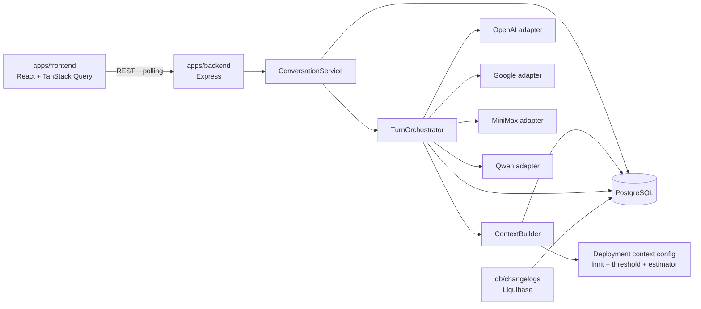

# Implementation Plan: Comparación y consolidación de respuestas LLM

**Branch**: `001-compare-llm-responses` | **Date**: 2026-07-27 | **Spec**: [spec.md](./spec.md)
**Input**: `specs/001-compare-llm-responses/spec.md`, incluidos FR-044–FR-052.

## Summary

ModelFuse se implementará como monolito modular en el monorepo pnpm: React/Vite
en `apps/frontend`, Express/TypeScript en `apps/backend`, primitivas Shadcn en
`packages/ui` y PostgreSQL administrado exclusivamente mediante Liquibase.

Cada submit crea o recupera idempotentemente una conversación/turno, inicia en
paralelo OpenAI, Google y MiniMax y usa Qwen para consolidar las respuestas base
disponibles. La API responde `202 Accepted`; TanStack Query consulta el turno por
polling y muestra cuatro tabs independientes.

Solo existe un turno con trabajo `pending`/`running` por conversación. Busy no es
global: bloquea Enviar, Retry y Delete únicamente en esa conversación, mantiene
Rename y la navegación disponibles y se libera cuando ningún turno ni slot sigue
activo. Replay por `clientRequestId` siempre se resuelve antes de evaluar busy.

`ContextBuilder` construye en backend una ventana aislada de turnos por slot. Antes
de cada adapter estima el tamaño contra el límite técnico del deployment y aplica
una protección con umbral configurable, 80% por defecto. La protección elimina
primero contexto histórico antiguo y recorta solo contenido contextual auxiliar
cuando sea necesario; nunca crea un presupuesto de producto ni contabilidad
persistente de tokens. Si el payload mínimo válido todavía no cabe, solo ese slot
falla con `INVALID_PROMPT_SIZE`.

## Technical Context

**Language/Version**: TypeScript 6, Node.js 22+, React 19
**Primary Dependencies**: Express 5, React/Vite 8, Axios, Zod, TanStack Query v5,
Shadcn UI/Tailwind, `pg`, Pino
**Storage**: PostgreSQL 16 con Liquibase 4.30 y changelogs SQL formateados
**Testing**: Vitest, React Testing Library, Supertest y Playwright
**Target Platform**: navegador moderno y servidor Node.js en entorno privado
monousuario
**Project Type**: aplicación web en monorepo pnpm, monolito modular
**Performance Goals**: con providers fake y PostgreSQL local, create y primera
página de historial bajo un segundo en al menos 95% del conjunto SC-010; al menos
95% de consultas fake alcanza estados terminales dentro de 60 segundos
**Constraints**: REST con polling; un turno activo por conversación; idempotencia
con `clientRequestId`; retry manual sin backoff; Continue-without irreversible;
cuatro slots fijos; contexto acotado por turnos con protección técnica de límite,
sin presupuesto de producto; sin WebSockets, SSE ni colas externas
**Scale/Scope**: un usuario privado, cuatro slots predefinidos, conversación
multiturno, sidebar e historial con cursores

Configuración técnica nueva:

- `CONVERSATION_CONTEXT_MAX_TURNS`: tamaño máximo de la ventana histórica.
- `LLM_CONTEXT_THRESHOLD_RATIO`: umbral técnico; default `0.8`, rango validado
  `(0,1]`.
- `OPENAI_CONTEXT_LIMIT_TOKENS`, `GOOGLE_CONTEXT_LIMIT_TOKENS`,
  `MINIMAX_CONTEXT_LIMIT_TOKENS`, `QWEN_CONTEXT_LIMIT_TOKENS`: límite técnico del
  deployment configurado.
- `VITE_POLL_INTERVAL_MS`: cadencia frontend, default `750`.
- `VITE_POLL_TIMEOUT_MS`: duración máxima de un ciclo de polling, default `60000`.

Las variables `VITE_*` son el nombre expuesto por Vite de la configuración lógica
de polling. Backend no usa la cadencia para alterar reglas de negocio.

Todas las decisiones técnicas necesarias están cerradas.

## Constitution Check

*GATE: Must pass before Phase 0 research. Re-check after Phase 1 design.*

- [x] `apps/frontend`, `apps/backend`, `packages/ui` y `db` mantienen ownership
      independiente y no importan internals de otra aplicación.
- [x] `index.ts`, `server.ts`, `app.ts`, routes, controllers, middleware,
      services e infrastructure conservan una responsabilidad.
- [x] Los cuatro providers usan adapters separados y resultados normalizados.
- [x] PostgreSQL es la fuente de verdad; `ContextBuilder` aísla historiales,
      acota turnos, protege límites técnicos y registra evidencia no sensible.
- [x] La protección técnica satisface el límite/costo constitucional sin crear
      presupuesto de producto ni persistir contabilidad estimada.
- [x] Primitivas reutilizables viven en `packages/ui`; busy, polling, cache y
      confirmaciones de producto viven en `apps/frontend`.
- [x] Todo esquema, constraint e índice se entrega mediante Liquibase.
- [x] Credenciales, prompts compuestos y payloads permanecen fuera de frontend,
      metadata y logs.
- [x] Idempotencia, busy, retry, Continue-without, delete y recovery tienen
      pruebas deterministas en su límite más bajo suficiente.
- [x] Las futuras tareas se pueden asignar a frontend, backend, DB, UI, testing y
      Product/UX sin tareas genéricas sobre directorios.
- [x] No existen excepciones constitucionales.

**Post-design re-check**: **PASS**. Research, data model, contratos y quickstart
proyectan FR-044–FR-052 sin tablas nuevas, retry automático, bloqueo global,
ranking, métricas persistentes ni política de presupuesto.

## Architecture



### Creation and idempotency

Ambos endpoints de creación siguen el mismo orden:

1. buscar replay por `clientRequestId`;
2. si el ID existe con el mismo prompt, devolver el recurso original sin crear
   filas ni ejecutar providers; con prompt distinto, responder
   `409 CLIENT_REQUEST_ID_CONFLICT`;
3. si es trabajo nuevo sobre una conversación existente, comprobar cualquier
   turno o slot `pending`/`running`;
4. responder `409 CONVERSATION_BUSY` si existe busy;
5. crear conversación/turno/cuatro slots en una transacción y responder `202`;
6. confirmar antes de iniciar providers.

`POST /conversations` aplica el mismo replay antes de insertar la conversación y
su primer turno. Constraints PostgreSQL resuelven submits concurrentes sin tabla
de idempotencia.

### Turn execution

1. `TurnOrchestrator` prepara en paralelo los tres slots base.
2. `ContextBuilder` consulta PostgreSQL por slot, arma la ventana y ejecuta la
   protección técnica de contexto antes de cada adapter.
3. Cada adapter realiza exactamente un intento; cada resultado o error seguro se
   persiste en su slot y `attempt_no` vigente.
4. Qwen se invoca con su historial consolidado acotado, prompt actual y respuestas
   base disponibles del turno actual. Slots con Continue-without se proyectan como
   ausencias permanentes.
5. El turno sigue `running` mientras cualquier turno/slot esté
   `pending`/`running`; después se recalcula `completed`, `partial` o `failed`.

### Retry and Continue-without

- Retry nunca tiene backoff ni intento automático.
- Retry base solo acepta `failed`, `error_recoverable=true` y
  `continued_without_at IS NULL`.
- La transición CAS `failed → pending` excluye dos retries simultáneos.
- Un turno activo distinto produce `409 CONVERSATION_BUSY`; el mismo slot ya
  activo produce `409 RESPONSE_RETRY_IN_PROGRESS`; cualquier slot no elegible,
  incluido Continue-without, produce `409 RESPONSE_NOT_RETRYABLE`.
- Retry base fallido no llama Qwen ni invalida su mejor consolidación vigente.
- Retry base exitoso marca Qwen `stale` y ejecuta una reconsolidación.
- Retry Qwen no invoca bases.
- Continue-without solo marca un slot base `failed`, no emite trabajo y es
  irreversible en v1. Qwen lo omite en cualquier consolidación posterior.

### Delete and navigation

`DELETE` bloquea brevemente la conversación, comprueba turnos y slots
`pending`/`running` y responde `409 CONVERSATION_BUSY` sin borrar si existe
trabajo. Sin busy, elimina en cascade. Rename sigue permitido durante busy.

Busy es por conversación. Navegar no cancela ni reasigna trabajo; los resultados
se guardan por `conversationId` y `turnId` de origen.

### Startup recovery

`server.ts` ejecuta `recoverInterruptedTurns()` antes de `listen()`. Recovery
termina slots persistidos `pending`/`running`, recalcula turnos/busy y no relanza
providers. `index.ts` solo inicia y detiene.

## Concurrency and Persistence Invariants

1. Como máximo un turno `pending`/`running` por conversación.
2. Todo slot activo implica turno `running`; ambos cambian en la misma
   transacción.
3. `hasWorkInProgress` consulta turnos y slots para detectar estados
   inconsistentes recuperables.
4. `conversations.create_client_request_id` es único global.
5. `(turns.conversation_id, turns.client_request_id)` es único.
6. Replay se resuelve antes de busy y nunca reinicia orquestación.
7. Cada submit lógico mantiene un UUID; un submit nuevo genera otro.
8. Retry usa CAS y `attempt_no`, no `clientRequestId`.
9. Completion/error solo actualiza si conserva el `attempt_no`; resultados
   tardíos no sobrescriben intentos posteriores.
10. `continued_without_at` solo existe en base `failed` y excluye retry para
    siempre en ese turno.
11. Delete solo hace cascade si la proyección busy es falsa dentro de la
    transacción.

## Context Composition and Token Protection

### Isolation

`ContextBuilder` vive en `apps/backend/src/services/conversations` y consulta una
ventana configurable de turnos recientes, independiente del historial visible:

- OpenAI, Google y MiniMax: prompts y respuestas completadas del mismo slot y
  prompt actual.
- Qwen: prompts y consolidaciones Qwen previas vigentes, prompt actual y
  respuestas base disponibles del turno actual.
- Qwen nunca recibe respuestas base históricas.
- PostgreSQL conserva el historial completo.

### Technical sizing flow

Para cada slot/deployment:

1. leer límite técnico y `LLM_CONTEXT_THRESHOLD_RATIO`;
2. calcular `floor(limit * threshold)` y estimar cada mensaje con
   `ceil(Buffer.byteLength(content, "utf8") / 3) + 4`, más dos tokens de
   overhead final; el mismo estimador conservador se aplica a los cuatro slots y
   cada uno usa el límite de su deployment;
3. si excede el umbral, eliminar primero turnos históricos completos desde el más
   antiguo;
4. si todavía excede, recortar únicamente contenido contextual auxiliar con
   marcadores explícitos, preservando roles, slot y el prompt actual;
5. volver a estimar tras cada cambio;
6. si el payload mínimo válido no cabe, no llamar al provider y persistir
   `INVALID_PROMPT_SIZE` como error seguro de ese slot.

La estimación es una validación previa efímera. No se almacena como métrica,
facturación, presupuesto o límite de producto. El estimador conservador compartido
y el margen configurable se prueban contra las capacidades fake; un rechazo real
por tamaño se normaliza también como `INVALID_PROMPT_SIZE`. Las métricas reales
informadas por providers siguen siendo opcionales y no persistidas en v1.

Evidencia segura en `metadata.contextWindow`:

```json
{
  "truncated": true,
  "firstIncludedOrdinal": 8,
  "lastIncludedOrdinal": 15,
  "protectionApplied": "turn-window-and-truncate"
}
```

No se persisten mensajes compuestos, estimaciones, límites, respuestas duplicadas
ni contenido recortado.

## Frontend Design

### Layout and ownership

`App` instala `QueryClientProvider` y monta `AppShell`:

- `ConversationSidebar`: listado infinito, fecha y menú de tres puntos.
- `ConversationWorkspace`: conversación seleccionada o draft vacío.
- `ConversationProcessingNotice`: busy textual.
- `ConversationTimeline`: turnos completos y sentinel superior.
- `TurnCard`, `ResponseTabs`, `ResponsePanel`: cuatro slots y estados.
- `ContextWindowNotice`: evidencia de ventana/protección sin contenido.
- `MessageComposer`: prompt y Enviar.
- `ContinueWithoutDialog`: confirmación permanente.

`packages/ui` contiene únicamente `Tabs`, `Dialog`, `DropdownMenu`,
`ScrollArea`, `Skeleton`, `Alert` y demás primitivas Shadcn. Toda semántica
ModelFuse queda en `apps/frontend`.

### Busy, first failure and management

Con `hasWorkInProgress=true`:

- Enviar y todos los Retry de esa conversación están disabled;
- aparece un aviso textual de procesamiento;
- Delete está disabled con el texto “No disponible mientras esta conversación
  está procesando un turno”;
- Rename y navegación siguen disponibles;
- Continue-without permanece disponible porque no emite trabajo.

La primera falla recuperable muestra inmediatamente Retry y Continue-without.
Retry puede verse disabled por busy. Antes de Continue-without, el dialog comunica:
“Continuar sin esta respuesta es permanente para este turno. Este slot no podrá
reintentarse.” Después de confirmar, la acción desaparece y el slot muestra
ausencia permanente.

Al pasar busy a false, Enviar y retries elegibles se reactivan incluso con turno
`failed` o `partial`; un slot Continue-without nunca vuelve a ser elegible.

### Server state, history and polling

TanStack Query administra listado/detalle, historial infinito, create, turn
create, rename, delete, retry, Continue-without y polling. Estado visual de tabs,
dialogs y expansión permanece local.

El hook de ejecución:

- conserva `clientRequestId` durante un submit lógico;
- usa `refetchInterval` de `VITE_POLL_INTERVAL_MS`, default 750 ms;
- devuelve `false` cuando `hasWorkInProgress=false`;
- corta el ciclo al alcanzar `VITE_POLL_TIMEOUT_MS`, default 60 s, sin cambiar el
  estado persistido; una futura invalidación, navegación o refetch inicia otro
  ciclo;
- cancela requests obsoletos con `AbortSignal`;
- actualiza cache por IDs de origen.

La carga inicial del chat obtiene hasta tres turnos y antepone bloques anteriores
con sentinel superior. El sidebar carga hacia abajo hasta llenar el contenedor o
agotar resultados. El colapso histórico es estado local.

## Backend Design

### Layers

- `index.ts`: start/stop.
- `server.ts`: configuración, dependencias, recovery y listen/close.
- `app.ts`: Express y `createApp()`.
- `routes/conversations`: rutas.
- `controllers/conversations`: traducción HTTP.
- `services/conversations`: `ConversationService`, `TurnOrchestrator`,
  `ContextBuilder`, idempotencia, retry y recovery.
- `infrastructure/postgres`: pool, repositories y transacciones.
- `infrastructure/llm`: contrato, adapters, capacidades de contexto y registro de
  slots.
- `types`: contratos HTTP/LLM.
- `utils`: cursores, título, estado y estimación técnica pura compartida.

### REST surface

| Method | Path | Purpose |
|---|---|---|
| `POST` | `/api/v1/conversations` | Create/replay; `202` |
| `GET` | `/api/v1/conversations` | Página de sidebar |
| `GET` | `/api/v1/conversations/:id` | Detalle y busy |
| `PATCH` | `/api/v1/conversations/:id` | Rename, permitido durante busy |
| `DELETE` | `/api/v1/conversations/:id` | Cascade o `409 CONVERSATION_BUSY` |
| `GET` | `/api/v1/conversations/:id/turns` | Hasta tres turnos |
| `POST` | `/api/v1/conversations/:id/turns` | Create/replay; `202` o 409 |
| `GET` | `/api/v1/conversations/:id/turns/:turnId` | Polling |
| `POST` | `/api/v1/conversations/:id/turns/:turnId/responses/:slot/retry` | Retry CAS |
| `POST` | `/api/v1/conversations/:id/turns/:turnId/responses/:slot/continue-without` | Ausencia irreversible |

### Provider abstraction

Cada adapter expone identidad, capacidad de contexto y estimación de entrada,
acepta mensajes normalizados y devuelve contenido, timestamps, métricas opcionales
informadas y metadata segura. `generate()` ejecuta un único request. Errores
incluyen `invalid_prompt_size`, autenticación, rate limit, conectividad, timeout,
contenido bloqueado o respuesta inválida sin bodies, headers ni secretos.

## Persistence and Liquibase

Se mantienen exactamente tres tablas:

- `conversations`: ID, request ID de creación, título y timestamps;
- `turns`: conversation ID, request ID, ordinal, prompt, estado y timestamps;
- `model_responses`: slot, rol, provider/model, estado, contenido/error,
  recoverability, Continue-without, stale, intento, metadata y timestamps.

Constraints principales:

- unique global de `create_client_request_id`;
- unique `(conversation_id, client_request_id)` y `(conversation_id, ordinal)`;
- unique parcial de turno activo por conversación;
- unique `(turn_id, slot)`;
- check: `continued_without_at` solo en base `failed`;
- retry CAS exige `continued_without_at IS NULL`;
- índices parciales de busy/recovery.

Delete usa transacción y consulta busy antes del `DELETE`; el cascade existente no
cambia. `metadata.contextWindow.protectionApplied` usa el JSONB existente. No se
añaden columnas ni tablas.

```text
db/changelogs/
├── db.changelog-master.xml
├── conversations/
│   ├── db.changelog-conversations.xml
│   └── 001-create-conversations-and-turns.sql
└── messages/
    ├── db.changelog-messages.xml
    └── 001-create-model-responses.sql
```

## Testing and Quality

### Backend unit

- aislamiento de contexto base/Qwen;
- estimación, threshold 80%, descarte de turnos antiguos, truncamiento auxiliar y
  fallback `INVALID_PROMPT_SIZE`;
- metadata segura sin contenido ni cifras estimadas;
- cálculo de busy;
- elegibilidad de retry excluyendo Continue-without;
- retry fallido/exitoso y Qwen stale;
- estados terminales y título determinista.

### Backend integration

- create/replay concurrente y orden replay → busy → create;
- busy por turno o slot y liberación terminal;
- retry concurrente y los tres errores 409;
- Continue-without irreversible y omitido por Qwen;
- delete busy sin cambios; delete terminal en cascade; rename durante busy;
- protección técnica por cada deployment fake sin afectar otros slots;
- recovery sin providers;
- historia/sidebar por cursores;
- SC-002 en 100% del fixture y SC-010 en al menos 95% del conjunto controlado.

### Frontend unit/integration

- Enviar/Retry/Delete disabled durante busy; Rename/navegación disponibles;
- mensaje contextual de Delete;
- primera falla muestra Retry y Continue-without;
- confirmación permanente y retiro de elegibilidad;
- polling inicia, se detiene por busy false o timeout y conserva IDs/cache;
- aviso de `contextWindow.protectionApplied`;
- sidebar e historial infinitos, tabs, dialogs y colapso.

### E2E

- comparación/consolidación y doble submit idempotente;
- busy aislado por conversación;
- retry y reconsolidación;
- Continue-without permanente;
- Delete bloqueado durante busy y cascade después;
- follow-up con aislamiento y protección de contexto;
- polling, reapertura, historial, sidebar, rename y draft nuevo.

### Product/UX acceptance

**SC-003 — Diseñar protocolo**
Owner: Product/UX. Entrega un protocolo versionado con guion para busy por
conversación, retry/Continue-without, contexto truncado, Delete bloqueado e
historial/polling; escenarios representativos y métricas subjetivas de claridad,
confianza, esfuerzo percibido y posible frustración.

**SC-004 — Ejecutar y documentar**
Owner: Product/UX. Ejecuta al menos una sesión con participantes, registra
observaciones/resultados y propone ajustes. El resumen sirve como insumo futuro;
no amplía la implementación de v1 dentro de este plan.

### Future task decomposition

`/speckit-tasks` debe crear tareas pequeñas con owner y archivos concretos para:

1. contexto/estimación/protección/fallback;
2. busy/idempotencia/retry;
3. Delete durante busy;
4. Continue-without irreversible;
5. polling y sus pruebas;
6. protocolo y ejecución Product/UX;
7. validaciones Liquibase, backend, frontend y E2E separadas.

Una validación amplia solo ejecuta checks. Cualquier defecto hallado se convierte
en una tarea específica por componente o flujo; no se corrige dentro de tareas
genéricas sobre directorios o globs.

SC-005 conserva el fixture de máximo cinco casos y umbral 90%; no crea ranking.

## Observability and Extension

Pino registra IDs técnicos, slot/provider/model, duración, busy, replay, recovery,
protección aplicada y código seguro, nunca prompts, respuestas, estimaciones,
límites, credenciales, headers o payloads.

Las métricas reales opcionales del provider siguen siendo extensión no persistida.
No se implementan ranking, dashboards, trazas distribuidas, colas ni nuevos
mecanismos de recovery.

## Project Structure

### Documentation

```text
specs/001-compare-llm-responses/
├── plan.md
├── research.md
├── data-model.md
├── quickstart.md
├── consolidation-evaluation.md
├── contracts/
│   ├── rest-api.md
│   └── llm-provider.md
└── tasks.md              # no modificado por este comando
```

### Source Code

```text
apps/
├── frontend/src/
│   ├── components/
│   ├── features/conversations/
│   ├── providers/
│   ├── types/
│   └── test/
└── backend/src/
    ├── controllers/conversations/
    ├── routes/conversations/
    ├── middleware/
    ├── services/conversations/
    ├── infrastructure/
    │   ├── llm/
    │   └── postgres/
    ├── types/
    ├── utils/
    ├── app.ts
    ├── server.ts
    └── index.ts
packages/ui/src/components/
db/changelogs/
├── db.changelog-master.xml
├── conversations/
└── messages/
```

**Structure Decision**: conservar el monolito modular existente. Solo se añaden
directorios que corresponden a responsabilidades presentes.

## Complexity Tracking

No hay violaciones constitucionales ni complejidad excepcional que justificar.
