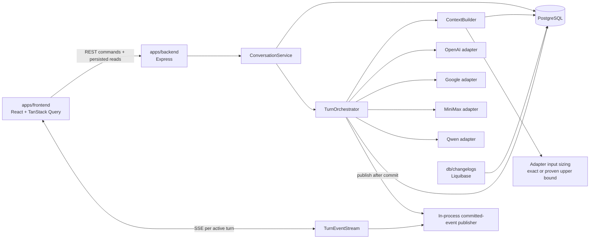

# Implementation Plan: Comparación y consolidación de respuestas LLM

**Branch**: `001-compare-llm-responses` | **Date**: 2026-07-31 | **Spec**: `specs/001-compare-llm-responses/spec.md`
**Input**: Feature specification from `specs/001-compare-llm-responses/spec.md`

## Summary

ModelFuse enviará cada prompt a tres modelos base y a Qwen como consolidador,
mantendrá conversaciones multiturno persistidas y proyectará cuatro slots en una
interfaz privada monousuario. La arquitectura es híbrida: REST crea trabajo,
consulta recursos persistidos y ejecuta acciones explícitas; después de un `202`,
el frontend abre un stream SSE por turno para recibir `slot_update`, `turn_update`
y el `busy_update` explícito hasta el estado terminal. SSE es el único mecanismo
de actualización en tiempo real de v1 y PostgreSQL permanece como fuente de
verdad. V1 no usa polling, long polling, WebSockets, streaming token por token,
colas externas ni fallback de transporte.

## Technical Context

**Language/Version**: TypeScript 6 sobre Node.js 22 y React 19
**Primary Dependencies**: Express 5, React, Vite, Axios, TanStack Query, Zod,
`pg`, Pino y primitivas Shadcn existentes; SSE nativo mediante `EventSource` en
frontend y `text/event-stream` en Express, sin librería de transporte adicional
**Storage**: PostgreSQL mediante `pg`; cambios exclusivamente con Liquibase
**Testing**: Vitest, Testing Library, Supertest y Playwright
**Target Platform**: navegador moderno y servidor Node.js en entorno privado
monousuario
**Project Type**: aplicación web en monorepo pnpm, monolito modular
**Performance Goals**: con providers fake y PostgreSQL local, create y primera
página de historial bajo un segundo en al menos 95% del conjunto SC-010; al menos
95% de consultas fake alcanza estados terminales dentro de 60 segundos
**Constraints**: REST + SSE; un turno activo por conversación; idempotencia con
`clientRequestId`; retry manual sin backoff; Continue-without irreversible;
cuatro slots fijos; contexto acotado por turnos con protección técnica medida por
contador exacto o cota superior verificable, que nunca subestima el tamaño; sin presupuesto de producto, polling, long polling,
WebSockets, streaming token por token, colas externas ni fallback de transporte
**Scale/Scope**: un usuario privado, un proceso backend, cuatro slots
predefinidos, conversación multiturno, sidebar e historial con cursores

Configuración técnica:

- `CONVERSATION_CONTEXT_MAX_TURNS`: tamaño máximo de la ventana histórica.
- `LLM_CONTEXT_THRESHOLD_RATIO`: umbral técnico; default `0.8`, rango `(0,1]`.
- `OPENAI_CONTEXT_LIMIT_TOKENS`, `GOOGLE_CONTEXT_LIMIT_TOKENS`,
  `MINIMAX_CONTEXT_LIMIT_TOKENS`, `QWEN_CONTEXT_LIMIT_TOKENS`: límites técnicos
  de los deployments configurados.
- `CONVERSATION_SIDEBAR_PAGE_SIZE`: tamaño fijo de página del sidebar.
- `VITE_HISTORY_COLLAPSE_CHAR_THRESHOLD`: umbral visual de colapso histórico.

No quedan decisiones funcionales abiertas para v1. Tras regenerar `tasks.md`, la
feature queda lista para implementación.

## Constitution Check

*GATE: Must pass before Phase 0 research. Re-check after Phase 1 design.*

- [x] `apps/frontend`, `apps/backend`, `packages/ui` y `db` mantienen ownership
      independiente y no importan internals de otra aplicación.
- [x] `index.ts`, `server.ts`, `app.ts`, routes, controllers, middleware,
      services e infrastructure conservan una responsabilidad.
- [x] Los cuatro providers usan adapters separados y contratos normalizados; SSE
      solo proyecta estado normalizado ya perteneciente al backend.
- [x] PostgreSQL es la fuente de verdad; `ContextBuilder` aísla historiales,
      acota turnos y exige conteo exacto o cota superior verificable.
- [x] La protección de contexto es técnica, no crea presupuesto de producto ni
      persiste contabilidad estimada.
- [x] Primitivas reutilizables viven en `packages/ui`; cache, SSE, busy y
      confirmaciones de producto viven en `apps/frontend`.
- [x] Todo esquema, constraint e índice se entrega mediante Liquibase.
- [x] Credenciales, prompts compuestos, payloads externos y contenido SSE quedan
      fuera de logs y metadata sensible.
- [x] Idempotencia, busy, SSE, retry, Continue-without, delete, recovery y sizing
      tienen la prueba mínima determinista en su límite propietario.
- [x] Las tareas unitarias, de integración y E2E se asignan exclusivamente a
      `unit-test-runner`, `integration-test-runner` y `e2e-test-runner`; builders
      implementan código de producto y auditores permanecen read-only.
- [x] Las validaciones cuantitativas SC-001 y SC-010 se asignan exclusivamente a
      `performance-test-runner`; no se transfiere a builders, auditores ni a un
      runner fuera de su alcance.
- [x] No existen excepciones constitucionales.

**Post-design re-check**: **PASS**. Research, modelo, contratos y quickstart
proyectan FR-044–FR-052 y FR-SSE-1–8 sin tablas nuevas, mecanismos de transporte
alternativos, infraestructura distribuida ni política de presupuesto.

## Architecture



El publicador vive en memoria dentro del monolito y solo notifica cambios
canónicos ya confirmados; también puede proyectar un `runtimeStage` no autoritativo
después de persistir el slot `running`. No es fuente de verdad, cola durable ni
bus externo. Después de cada commit, asigna a todo `slot_update`, `turn_update` y
`busy_update` un `eventSequence` entero estrictamente creciente por `turnId`.
`updatedAt` y, para slots, `attemptNo` conservan la versión canónica; la secuencia
desempata cambios distintos con los mismos valores. Al abrir un stream, el
endpoint registra primero el listener y acumula temporalmente sus eventos mientras
lee y emite el snapshot PostgreSQL vigente, incluido el último `eventSequence`
representado. Después descarta del buffer los eventos cuya tupla
`(updatedAt, attemptNo, eventSequence)` —o `(updatedAt, eventSequence)` cuando no
aplica intento— sea menor o igual a la del snapshot, drena las restantes en ese
orden y continúa en vivo. `eventSequence` es efímero y local al proceso: no se
persiste, no es un ID durable, no habilita `Last-Event-ID` ni replay histórico.

## Request and Turn Lifecycle

### Creation and idempotency

1. `POST /api/v1/conversations` o
   `POST /api/v1/conversations/:conversationId/turns` busca replay por
   `clientRequestId` antes de busy.
2. Mismo ID y prompt devuelve el recurso; prompt distinto responde
   `409 CLIENT_REQUEST_ID_CONFLICT`.
3. Trabajo nuevo bloquea brevemente la conversación, comprueba cualquier turno o
   slot `pending`/`running` y responde `409 CONVERSATION_BUSY` si existe busy.
4. Conversación/turno/cuatro slots se insertan en una transacción; el endpoint
   responde `202` antes de esperar providers.
5. El frontend abre
   `GET /api/v1/conversations/:conversationId/turns/:turnId/events`.
6. El stream registra su listener, bufferiza durante la lectura, entrega el
   snapshot actual con su último `eventSequence` representado, descarta por la
   tupla formal de versión, drena en orden los eventos posteriores y luego
   continúa en vivo con eventos canónicos posteriores a cada commit y
   `runtimeStage` efímeros solo para slots ya persistidos `running`.
7. La UI cierra su `EventSource` al recibir turno terminal y
   `hasWorkInProgress=false`; el servidor también puede cerrar ese stream.

### Turn execution

1. `TurnOrchestrator` prepara en paralelo los tres slots base.
2. `ContextBuilder` consulta PostgreSQL por slot, compone su ventana y aplica la
   protección técnica antes del adapter.
3. Cada transición canónica (`pending`, `running`, `completed`, `failed`) y cada
   resultado normalizado se persiste antes de publicar su `slot_update`.
4. Estados visuales como “pensando”, “analizando contexto” o “consolidando” se
   publican como `runtimeStage` opcional; no se persisten ni sustituyen el status.
5. Qwen usa su historial consolidado acotado, el prompt actual y las respuestas
   base disponibles del turno actual; Continue-without se proyecta como ausencia.
6. Cada cambio agregado se persiste y publica como `turn_update`; cada cambio de
   busy se publica separadamente como `busy_update`.
7. El turno queda `running` mientras exista slot activo y termina `completed`,
   `partial` o `failed`.

No se emiten fragmentos token por token. Un evento terminal contiene el resultado
normalizado completo disponible.

### Reconnection and recovery

- Al recargar o reabrir una conversación, TanStack Query lee detalle/historial
  persistido. Si encuentra un turno activo, abre un `EventSource` nuevo para ese
  `turnId`; el snapshot inicial cubre eventos ocurridos durante la desconexión.
- `EventSource` puede reconectar el mismo endpoint. Mientras el stream está en
  error, la UI muestra un aviso de actualización en tiempo real; lo retira al
  abrirse de nuevo. Nunca inicia otro transporte.
- Si no puede establecerse o restablecerse, el error permanece visible y pide
  intentar más tarde. No hay polling, long polling ni WebSockets de respaldo.
- En startup, `server.ts` ejecuta `recoverInterruptedTurns()` antes de `listen()`:
  termina slots `pending`/`running`, recalcula turnos/busy y no relanza providers.
  Una conexión posterior recibe ese estado reconciliado desde PostgreSQL.
- No se implementan IDs durables de evento, `Last-Event-ID`, replay histórico,
  garantías de bus distribuido ni colas externas.

## Concurrency and Persistence Invariants

1. Como máximo un turno `pending`/`running` por conversación.
2. Todo slot activo implica turno `running`; ambos cambian en la misma
   transacción.
3. `hasWorkInProgress` consulta turnos y slots; no se persiste ni se infiere en
   frontend desde `turn_update`.
4. `busy_update` se emite explícitamente después de cada commit que pueda cambiar
   la proyección canónica.
5. `conversations.create_client_request_id` es único global y
   `(turns.conversation_id, turns.client_request_id)` es único.
6. Replay se resuelve antes de busy y nunca reinicia orquestación.
7. Retry usa CAS y `attempt_no`; resultados tardíos no sobrescriben intentos
   posteriores ni actualizan la UI como vigentes.
8. `continued_without_at` solo existe en base `failed` y excluye retry para
   siempre en ese turno.
9. Delete solo hace cascade si busy es falso dentro de la transacción.
10. Eventos SSE no adelantan ni sustituyen la persistencia que representan.

## Retry, Continue-without and Delete

- Backend decide elegibilidad y transiciones. Retry es manual, por slot, sin
  backoff ni intento automático.
- Un turno activo distinto produce `409 CONVERSATION_BUSY`; el mismo slot activo,
  `409 RESPONSE_RETRY_IN_PROGRESS`; un slot no elegible o con Continue-without,
  `409 RESPONSE_NOT_RETRYABLE`.
- Retry base fallido no invoca Qwen ni invalida la consolidación vigente. Retry
  base exitoso marca Qwen `stale` y ejecuta una reconsolidación. Retry Qwen no
  ejecuta bases.
- Continue-without marca irreversiblemente un slot base `failed`, no emite trabajo
  y permanece disponible durante busy.
- Delete responde `409 CONVERSATION_BUSY` durante trabajo; fuera de busy elimina
  en cascade. Rename permanece permitido.
- Frontend solo proyecta estado: botones disabled, errores seguros, aviso busy y
  copy permanente de Continue-without. Las respuestas HTTP siguen protegiendo
  contra clientes obsoletos o llamadas directas.

## Context Composition and Token Protection

### Isolation

- OpenAI, Google y MiniMax reciben prompts y respuestas completadas de su mismo
  slot más el prompt actual.
- Qwen recibe prompts y consolidaciones Qwen previas vigentes, prompt actual y
  respuestas base disponibles del turno actual; nunca respuestas base históricas.
- PostgreSQL conserva el historial completo aunque el payload enviado sea
  acotado.

### Technical sizing flow

Cada adapter/deployment expone el límite y un medidor que produce un conteo exacto
cuando exista un tokenizer/contador compatible, o una cota superior conservadora
demostrable para ese protocolo y versión. La medición incluye mensajes y overhead
del envelope. No se admite un heurístico que pueda subestimar.

1. calcular `floor(limit * LLM_CONTEXT_THRESHOLD_RATIO)`;
2. medir el payload con el contador exacto o la cota superior del adapter;
3. si excede el umbral, eliminar turnos históricos completos desde el más antiguo;
4. si aún excede, recortar solo contexto auxiliar con marcadores explícitos,
   preservando roles, slot y prompt actual;
5. volver a medir después de cada cambio;
6. si el payload mínimo no cabe, no llamar al provider y persistir
   `INVALID_PROMPT_SIZE` como error seguro del slot.

Los contract tests de cada medidor cubren ASCII, puntuación densa, Unicode, emoji,
scripts no latinos y contenido fragmentado/con delimitadores. Cuando el provider
o tokenizer de referencia expone el conteo real, prueban `medición >= real` para
la cota y equivalencia para el modo exacto. Un deployment solo se configura con
un medidor cuya garantía esté documentada y probada.

La medición es efímera: no se persisten tokens estimados, límites, payloads
compuestos, respuestas duplicadas ni contenido recortado. `metadata.contextWindow`
solo registra si hubo protección, ordinales incluidos y tipo de protección. No se
crea presupuesto, facturación ni política de producto por modelo.

## Frontend Design

### Layout and ownership

`App` instala `QueryClientProvider` y monta `AppShell`, sidebar, workspace,
timeline, cards/tabs de cuatro slots, avisos de busy/contexto/SSE, composer y
diálogo Continue-without. `packages/ui` conserva primitivas visuales agnósticas;
toda semántica ModelFuse vive en `apps/frontend`.

### Server state and SSE orchestration

- TanStack Query gestiona sidebar, detalle, historial infinito, create, turn
  create, rename, delete, retry y Continue-without.
- Un hook localizado posee como máximo un `EventSource` para el turno seguido.
  Tras create/retry o al abrir detalle con trabajo, aplica snapshots/eventos por
  `conversationId` y `turnId` sobre la entrada canónica del query cache; no copia
  el turno completo en un segundo store.
- Tabs, dialogs, expansión y `runtimeStage` efímero permanecen locales.
- `slot_update` actualiza solo su slot, `turn_update` el agregado y
  `busy_update` la proyección explícita `hasWorkInProgress`.
- Actualizaciones con una tupla `updatedAt`/`attemptNo`/`eventSequence` anterior
  o igual a la última aplicada se ignoran; timestamps iguales y varios cambios
  del mismo intento se resuelven mediante `eventSequence`.
- Cuando `busy_update=false` y el turno es terminal, el hook cierra el stream e
  invalida una vez el detalle/turno para confirmar convergencia persistida; no hay
  fetch periódico.
- Un error del stream produce aviso visible. La reconexión conserva SSE y nunca
  degrada a otro mecanismo.

### Data-backed UI states

- El título sigue tres límites separados: el backend aplica únicamente `trim` y
  valida longitud 1–80; PostgreSQL lo persiste literalmente mediante consultas
  parametrizadas; React lo renderiza como texto, sin HTML crudo ni escape
  almacenado. No se eliminan ni reemplazan caracteres especiales.
- Sidebar e historial distinguen carga inicial, vacío confirmado, error y
  contenido cargado; nunca representan carga como vacío.
- Una carga incremental fallida conserva conversaciones o turnos visibles y
  ofrece reintento manual; mientras está pendiente no inicia otra carga igual.
- Rename/Delete deshabilitan la confirmación pendiente. Un error seguro conserva
  diálogo y datos; el éxito cierra el diálogo, actualiza el cache canónico y
  devuelve el foco a un destino válido. El resultado visible basta como estado de
  éxito, sin exigir toast.
- La composición de producto reutiliza `Skeleton` y `Alert` de `packages/ui`; no
  crea una abstracción genérica adicional para estos estados.

### Busy and actions

FR-045 es la regla canónica backend: busy existe por cualquier turno/slot
`pending`/`running`. FR-049 y FR-SSE-3 proyectan esa regla: `busy_update=true`
deshabilita Enviar y Retry, mantiene navegación y Continue-without, y deshabilita
Delete con explicación; `busy_update=false` reactiva acciones elegibles. Rename
permanece disponible. Estado local de mutación evita doble click antes del primer
evento, sin reemplazar validación backend.

## Backend Design

### Layers

- `index.ts`: start/stop.
- `server.ts`: configuración, dependencias, recovery y listen/close.
- `app.ts`: Express y `createApp()`.
- routes/controllers: endpoints REST y traducción del stream SSE.
- services: `ConversationService`, `TurnOrchestrator`, `ContextBuilder`, retry,
  recovery y publicación de eventos comprometidos.
- infrastructure/postgres: pool, repositories y transacciones.
- infrastructure/llm: contrato, adapters, medidores de entrada y registro de slots.
- types/utils: contratos HTTP/SSE/LLM, cursores, título y estado puro.

El endpoint SSE valida que conversación y turno correspondan, fija headers
`text/event-stream`, `Cache-Control: no-cache` y `Connection: keep-alive`, se
suscribe antes de leer el snapshot persistido, incluye el último
`eventSequence` representado, descarta por la tupla formal, drena el buffer de
apertura y se desuscribe al cerrar la request. El publicador en proceso se inyecta
en servicios; controllers no observan repositorios ni reglas de dominio.

### HTTP surface

| Method | Path | Purpose |
|---|---|---|
| `POST` | `/api/v1/conversations` | Create/replay; `202` |
| `GET` | `/api/v1/conversations` | Página de sidebar |
| `GET` | `/api/v1/conversations/:id` | Detalle persistido y busy |
| `PATCH` | `/api/v1/conversations/:id` | Rename durante busy |
| `DELETE` | `/api/v1/conversations/:id` | Cascade o `409 CONVERSATION_BUSY` |
| `GET` | `/api/v1/conversations/:id/turns` | Historial por bloques de tres |
| `POST` | `/api/v1/conversations/:id/turns` | Create/replay; `202` o 409 |
| `GET` | `/api/v1/conversations/:id/turns/:turnId` | Snapshot persistido puntual |
| `GET` | `/api/v1/conversations/:id/turns/:turnId/events` | Stream SSE del turno |
| `POST` | `/api/v1/conversations/:id/turns/:turnId/responses/:slot/retry` | Retry CAS |
| `POST` | `/api/v1/conversations/:id/turns/:turnId/responses/:slot/continue-without` | Ausencia irreversible |

## Persistence and Liquibase

Se mantienen exactamente `conversations`, `turns` y `model_responses`, con los
constraints ya definidos para idempotencia, ordinal, turno activo, slots, retry y
Continue-without. SSE y sus estados visuales no añaden tablas, columnas ni
changesets: se derivan de commits y de una proyección efímera en proceso.

Todos los changesets de v1 DEBEN incluir rollback explícito verificable. La
validación de base de datos DEBE ejecutarse sobre una PostgreSQL desechable en
este orden: migración desde cero, validación del esquema resultante, rollback,
comprobación del estado anterior, nueva aplicación de los changesets y validación
final del esquema reaplicado. Este rollback es un quality gate técnico de
Liquibase; no constituye recovery de producto ni un rollback automático en
producción.

## Testing and Quality

### Test ownership

- `unit-test-runner` crea, modifica y ejecuta pruebas unitarias aisladas y
  contract-unit, incluidas pruebas de componentes/hooks con colaboradores
  mockeados.
- `integration-test-runner` crea, modifica y ejecuta pruebas sin navegador que
  mantienen dos o más componentes reales: REST/SSE, PostgreSQL/Liquibase,
  adapters con fakes y frontend con hooks/providers/cache reales.
- `e2e-test-runner` crea, modifica y ejecuta exclusivamente journeys Playwright
  observados mediante un navegador real.
- `performance-test-runner` crea, modifica y ejecuta exclusivamente validaciones
  de latencia/distribución que los tres runners anteriores excluyen, usando
  medición Node.js acotada o k6 cuando la carga concurrente/sostenida lo exige.
- Builders modifican solo código de producto y seams de testabilidad; no crean,
  modifican ni ejecutan pruebas. Auditores permanecen read-only. La prueba mínima
  indicada en una tarea de implementación es su criterio de aceptación y no
  transfiere ownership al builder.

### Backend unit and contract

- aislamiento de contexto base/Qwen;
- medidor exacto/cota por deployment con ASCII, puntuación, Unicode/emoji,
  scripts no latinos, fragmentos y delimitadores; nunca menor al conteo de
  referencia y `INVALID_PROMPT_SIZE` sin llamar provider;
- publicación solo después del commit y eventos con IDs correctos;
- `busy_update` explícito, incluso cuando coincide temporalmente con
  `turn_update`;
- busy, retry/Continue-without, terminales y recovery deterministas.

### Backend integration

- selección de contexto contra PostgreSQL: cada base recupera solo su historial,
  Qwen solo consolidaciones previas vigentes, ambas ventanas conservan orden y
  aislamiento entre conversaciones, y nunca se incorporan historiales base a Qwen;
- create/replay concurrente y orden replay → busy → create;
- endpoint SSE valida pertenencia, headers, suscripción previa al snapshot,
  `eventSequence` monótono, timestamps iguales, varios cambios del mismo intento,
  buffering y descarte/drenaje sin pérdida ante un commit concurrente, los tres
  nombres de evento, resultados finales, cierre terminal y cleanup al desconectar;
- estado SSE coincide con PostgreSQL y nunca anuncia una transacción fallida;
- retry concurrente y los tres 409; Continue-without irreversible;
- delete busy, rename busy con persistencia literal de comillas, `<`, `>`,
  acentos, emojis y HTML, historia/sidebar y recovery sin providers;
- SC-002 al 100% del fixture de recuperación.

### Performance acceptance

- SC-001 y SC-010 pertenecen exclusivamente a `performance-test-runner`; unit,
  integration y E2E no autoran ni ejecutan estas validaciones cuantitativas.
- SC-001 usa PostgreSQL local y providers fake deterministas, considera exitosa
  solo la consulta cuyos cuatro slots obtienen una respuesta o estado terminal
  explícito dentro de 60 segundos, registra total, éxitos, porcentaje y
  `pass`/`fail`, y falla por debajo del 95%.
- En el entorno local controlado con PostgreSQL y providers fake deterministas,
  mide el p95 de `POST /conversations` y del primer bloque de historial contra el
  umbral de un segundo definido en el spec.
- Las pruebas funcionales demuestran primero la corrección de ambos flujos; la
  validación de rendimiento no duplica sus aserciones ni modifica producción al
  encontrar una regresión.

### Frontend unit/integration

- un stream por turno seguido, aplicación idempotente al cache e invalidación
  final única;
- `slot_update`, `turn_update`, `busy_update` y runtimeStage sin cambiar estados
  canónicos;
- empates de `updatedAt`/`attemptNo`, duplicados y eventos antiguos resueltos por
  `eventSequence` sin descartar cambios consecutivos legítimos;
- Enviar/Retry/Delete disabled por `busy_update`; navegación, Rename y
  Continue-without disponibles según spec;
- primera falla muestra Retry/Continue-without; copy permanente;
- reload/reopen crea stream nuevo; error visible y reconexión solo SSE;
- ninguna llamada periódica ni fallback alternativo;
- sidebar/historial distinguen loading, empty, error y success; un fallo
  incremental conserva contenido y permite reintento manual;
- Rename/Delete cubren pending/disabled, error sin perder diálogo/datos, success
  canónico y restauración de foco; los títulos con comillas, `<`, `>`, acentos,
  emojis y HTML literal se muestran como texto y nunca como markup;
- tabs, dialogs y colapso.

### E2E

- create `202` → SSE → cuatro resultados/terminal → cierre;
- comparación/consolidación e idempotencia;
- busy aislado por conversación y proyección `busy_update`;
- retry/reconsolidación y Continue-without permanente;
- Delete bloqueado durante busy y cascade después; Rename permitido;
- follow-up con aislamiento y protección de contexto;
- desconexión/reapertura mediante stream SSE nuevo, error visible sin fallback;
- historial, sidebar y draft nuevo.

### Product/UX acceptance

Product/UX entrega un protocolo versionado con tareas concretas, escenarios
representativos, criterio observable por tarea y escalas subjetivas de claridad,
confianza, esfuerzo y frustración. Debe cubrir comparación/consolidación, busy,
retry/Continue-without, contexto acotado, Delete bloqueado, historial y error SSE.
Antes de ejecutar, el protocolo fija un grupo de al menos diez participantes
válidos —el mismo grupo puede evaluar SC-003 y SC-004—, junto con sus criterios
de inclusión y exclusión; la muestra y el denominador no se reconfiguran después
de iniciar la primera tarea.

La ejecución con participantes registra por separado para SC-003 y SC-004:
muestra prevista, participantes válidos, exclusiones justificadas, numerador de
participantes que completan sin ayuda en el primer intento, denominador,
porcentaje y resultado `pass`/`fail` frente al 90%, además de observaciones y
propuestas. Una sesión sin esa evidencia cuantificable no satisface los criterios.

## Requirement Ownership Traceability

- Dominio/backend: FR-040, FR-045, FR-047, FR-050 y FR-051 definen primera falla,
  busy, elegibilidad/transiciones HTTP, Delete y Continue-without.
- UI/tiempo real: FR-048, FR-049, FR-053 y FR-SSE-3/4/6/7/8 proyectan acciones,
  busy, estados de datos, conexión/error y alcance exclusivo de SSE.
- Integración: FR-052 y FR-SSE-1/2/5 unen comandos REST, stream por turno, eventos
  posteriores al commit y cierre terminal.

Son capas complementarias: backend conserva autoridad aun si la UI está
desactualizada; SSE comunica la proyección sin redefinir el dominio.

## Future Task Decomposition

`/speckit-tasks` debe crear tareas pequeñas con owner y archivos concretos para:

1. persistencia/idempotencia/busy y Liquibase;
2. adapters, sizing verificable y ContextBuilder;
3. orquestación, retry, Continue-without, delete y recovery;
4. publicador en proceso, contrato y endpoint SSE;
5. cache TanStack Query, hook SSE y proyección UI;
6. historial/sidebar/gestión y componentes;
7. pruebas backend, frontend, E2E y aceptación controlada separadas;
8. protocolo y evidencia cuantitativa Product/UX.

No se modifica `tasks.md` en este comando.

## Observability and Extension

Pino registra IDs técnicos, slot/provider/model, duración, busy, conexión/cierre
SSE, replay, recovery, protección aplicada y código seguro; nunca prompts,
respuestas, payloads/eventos completos, estimaciones, límites, credenciales ni
headers. No se implementan métricas persistentes, dashboards, trazas distribuidas,
ranking, colas, replay durable ni otros transportes.

## Project Structure

### Documentation (this feature)

```text
specs/001-compare-llm-responses/
├── plan.md
├── research.md
├── data-model.md
├── quickstart.md
├── consolidation-evaluation.md
├── contracts/
│   ├── rest-api.md
│   └── llm-provider.md
└── tasks.md              # no modificado por este comando
```

### Source Code (repository root)

```text
apps/
├── frontend/src/
│   ├── components/
│   ├── features/conversations/
│   ├── providers/
│   ├── types/
│   └── test/
└── backend/src/
    ├── controllers/conversations/
    ├── routes/conversations/
    ├── middleware/
    ├── services/conversations/
    ├── infrastructure/
    │   ├── llm/
    │   └── postgres/
    ├── types/
    ├── utils/
    ├── app.ts
    ├── server.ts
    └── index.ts
packages/ui/src/components/
db/changelogs/
├── db.changelog-master.xml
├── conversations/
└── messages/
```

**Structure Decision**: conservar el monolito modular existente. SSE usa el
backend y frontend actuales; no crea workspace, servicio ni infraestructura.

## Complexity Tracking

No hay violaciones constitucionales ni complejidad excepcional que justificar.
