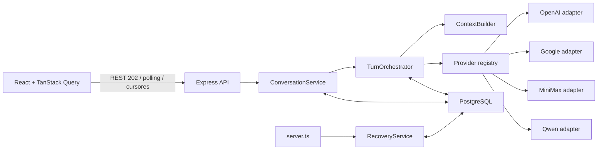

# Implementation Plan: Comparación y consolidación de respuestas LLM

**Branch**: `001-compare-llm-responses` | **Date**: 2026-07-25 | **Spec**: [spec.md](./spec.md)
**Input**: Feature specification from `specs/001-compare-llm-responses/spec.md`

## Summary

ModelFuse seguirá como monolito modular: React/Vite en `apps/frontend`,
Express/TypeScript en `apps/backend`, primitives Shadcn/Tailwind en `packages/ui`
y PostgreSQL gobernado por Liquibase.

Cada prompt crea un turno persistido con tres slots base —OpenAI, Google y
MiniMax— ejecutados en paralelo y un slot Qwen que consolida después las respuestas
disponibles. Cada proveedor usa un adapter propio; ningún flujo de dominio depende
de un protocolo externo común.

La API responde `202` y TanStack Query administra listas, historial infinito,
polling y mutaciones. El sidebar carga conversaciones hacia abajo; el chat carga
bloques anteriores de tres turnos hacia arriba.

## Technical Context

**Language/Version**: Node.js >=22, TypeScript ~6, React 19.2 y Express 5.2

**Primary Dependencies**: Vite 8, `@tanstack/react-query` v5, Shadcn UI 4,
Tailwind CSS 4, Axios 1.18, Zod 4, `pg`, Pino, pnpm 11 y Turborepo

**Storage**: PostgreSQL 16; Liquibase 4.30 con SQL formateado

**Testing**: Vitest 4, Testing Library, Supertest y Playwright

**Target Platform**: Navegadores modernos y Node.js en Linux/contenedores

**Project Type**: Aplicación web en monorepo, monolito modular

**Performance Goals**: En entorno local con providers fake, p95 menor a un
segundo para `POST /conversations` y para el primer bloque de historial; al menos
95% de turnos con estado terminal dentro de 60 segundos

**Constraints**: Cuatro integraciones fijas; adapters separados; bloques de chat
de tres turnos; ventana de contexto acotada por turnos; sin presupuesto de tokens
por modelo; credenciales ausentes bloquean startup; sin SSE, WebSockets ni colas
externas

**Scale/Scope**: Primera versión privada para un usuario, una conversación visible
a la vez y fixture de consolidación de máximo cinco casos

## Constitution Check

*GATE: Must pass before Phase 0 research. Re-checked after Phase 1 design.*

- [x] Ownership permanece en `apps/frontend`, `apps/backend`, `packages/ui` y
      `db`, sin imports cruzados entre aplicaciones.
- [x] `index.ts` solo invoca start/stop; `server.ts` compone y recupera; `app.ts`
      configura Express; rutas, controllers, middleware, services e
      infrastructure conservan responsabilidades únicas.
- [x] OpenAI, Google, MiniMax y Qwen tienen adapters separados y normalizan
      respuestas antes de orquestación.
- [x] PostgreSQL es fuente de verdad y los cuatro contextos lógicos están
      aislados; la ventana se expresa por turnos incluidos, no por presupuesto de
      tokens.
- [x] TanStack Query vive en frontend; `packages/ui` contiene únicamente
      primitives reutilizables.
- [x] Todo cambio de esquema usa SQL formateado incluido por XML de módulo.
- [x] Zod valida HTTP y entorno; claves, prompts y respuestas quedan fuera de
      logs.
- [x] El diseño cubre unitarias, integración, migraciones, recovery, rendimiento,
      evaluación acotada y E2E.
- [x] El trabajo puede dividirse entre owners frontend, backend, DB, UI y testing
      con integración explícita.
- [x] No hay violaciones que requieran excepción.

**Gate result before research**: PASS
**Gate result after design**: PASS

## Project Structure

### Documentation

```text
specs/001-compare-llm-responses/
├── plan.md
├── research.md
├── data-model.md
├── quickstart.md
├── consolidation-evaluation.md
├── contracts/
│   ├── rest-api.md
│   └── llm-provider.md
└── tasks.md
```

### Source Code

```text
apps/
├── frontend/
│   ├── e2e/
│   └── src/
│       ├── components/layout/
│       ├── providers/query-provider.tsx
│       └── features/conversations/
│           ├── api/
│           ├── components/
│           ├── hooks/
│           ├── queries/
│           ├── schemas/
│           ├── types/
│           └── __tests__/
└── backend/src/
    ├── index.ts
    ├── server.ts
    ├── app.ts
    ├── controllers/conversations/
    ├── routes/conversations/
    ├── middleware/validation/
    ├── services/conversations/
    ├── services/llm/
    ├── infrastructure/config/
    ├── infrastructure/llm/providers/
    │   ├── openAiProvider.ts
    │   ├── googleProvider.ts
    │   ├── miniMaxProvider.ts
    │   └── qwenProvider.ts
    ├── infrastructure/postgres/repositories/
    ├── types/
    └── utils/

packages/ui/src/components/

db/changelogs/
├── conversations/
├── messages/
└── db.changelog-master.xml
```

**Structure Decision**: Se reutilizan los workspaces actuales. Solo
`@tanstack/react-query` y Playwright se añaden donde son necesarios. No se crea un
workspace de contratos, estado o providers.

## Architecture



Una conversación contiene turnos; cada turno contiene un prompt y cuatro filas de
respuesta. Las “cuatro conversaciones” son contextos derivados por slot, no
cuatro entidades de conversación duplicadas.

## Provider Integrations

| Slot | External interface | Adapter responsibility |
|---|---|---|
| `openai` | OpenAI Responses API | Traducir mensajes y normalizar output/usage/errors |
| `google` | Gemini `generateContent` | Traducir roles/parts, feedback, usage y errores |
| `minimax` | MiniMax `chatcompletion_v2` | Traducir messages/choices/usage y errores |
| `qwen` | DashScope native text generation | Traducir input/output, usage y errores |

Todos implementan el contrato de [contracts/llm-provider.md](./contracts/llm-provider.md),
aceptan `AbortSignal` y devuelven `content`, proveedor, modelo, timestamps, usage
disponible y metadata JSON-safe. No se comparten payloads externos ni ramas por
proveedor dentro de `TurnOrchestrator`.

### Runtime configuration

Backend valida en un único boundary:

```dotenv
OPENAI_API_KEY=
OPENAI_MODEL=
GEMINI_API_KEY=
GOOGLE_MODEL=
MINIMAX_API_KEY=
MINIMAX_MODEL=
DASHSCOPE_API_KEY=
DASHSCOPE_BASE_URL=
QWEN_MODEL=
LLM_PROVIDER_TIMEOUT_MS=
CONVERSATION_CONTEXT_MAX_TURNS=
CONVERSATION_SIDEBAR_PAGE_SIZE=
```

Frontend valida configuración no secreta:

```dotenv
VITE_API_BASE_URL=
VITE_HISTORY_COLLAPSE_CHAR_THRESHOLD=
```

Una variable requerida ausente detiene startup e identifica solo su nombre. Una
clave presente pero rechazada se normaliza como error `authentication` en el slot
afectado. No existen variables de presupuesto de tokens ni límites de salida por
modelo.

## Turn Lifecycle

### Initial execution

1. El cliente envía `clientRequestId` y prompt.
2. Una transacción crea conversación, título determinista, turno y cuatro slots
   `pending`.
3. La API responde `202` antes de esperar proveedores.
4. `Promise.allSettled` ejecuta OpenAI, Google y MiniMax en paralelo.
5. Cada resultado se persiste de forma independiente.
6. Qwen recibe su contexto permitido y las respuestas base disponibles.
7. El turno termina `completed`, `partial` o `failed`.
8. `useQuery` consulta el turno cada segundo y se detiene al llegar a estado
   terminal.

### Retry and continue

- Retry solo cambia el slot seleccionado de `failed` a `pending/running`.
- Retry de Qwen no ejecuta modelos base.
- Retry base fallido conserva la consolidación existente y no ejecuta Qwen.
- Retry base exitoso marca la consolidación como `stale`, ejecuta Qwen y reemplaza
  contenido/usage al completar correctamente.
- Mientras la consolidación se actualiza o si falla, el último contenido puede
  permanecer visible con marca `stale`.
- “Continuar sin respuesta” persiste `continuedWithoutAt` en el slot base fallido
  y permite crear el siguiente turno.
- Una respuesta base recuperada limpia `continuedWithoutAt`.

La API no crea un segundo turno para retry.

## REST API

Contrato detallado: [contracts/rest-api.md](./contracts/rest-api.md).

| Method | Path | Purpose |
|---|---|---|
| `POST` | `/api/v1/conversations` | Crear conversación y primer turno (`202`) |
| `GET` | `/api/v1/conversations?cursor` | Página fija del sidebar |
| `GET` | `/api/v1/conversations/:id` | Metadatos sin historial |
| `PATCH` | `/api/v1/conversations/:id` | Renombrar |
| `DELETE` | `/api/v1/conversations/:id` | Eliminar en cascade |
| `GET` | `/api/v1/conversations/:id/turns?before` | Tres turnos más recientes o anteriores |
| `POST` | `/api/v1/conversations/:id/turns` | Crear turno (`202`) |
| `GET` | `/api/v1/conversations/:id/turns/:turnId` | Polling de turno |
| `POST` | `/api/v1/conversations/:id/turns/:turnId/responses/:slot/retry` | Reintentar slot |
| `POST` | `/api/v1/conversations/:id/turns/:turnId/responses/:slot/continue-without` | Persistir decisión de continuar |

Los cursores son opacos Base64URL:

- sidebar: `{updatedAt,id}`, orden descendente y página definida por
  `CONVERSATION_SIDEBAR_PAGE_SIZE`;
- turnos: `{ordinal,id}`, selección descendente `LIMIT 3` y respuesta invertida a
  orden cronológico.

La API nunca pagina mensajes sueltos. “Limpiar conversación” es estado local: no
existe endpoint `clear` ni conversación vacía persistida.

## Frontend Design

`main.tsx` monta `ThemeProvider`, `QueryProvider` y `App`. `App.tsx` compone
`AppShell`; no implementa reglas de datos.

### Components

- `AppShell`, `ConversationSidebar`, `ConversationListItem`,
  `ConversationMenu`.
- `RenameConversationDialog`, `DeleteConversationDialog`.
- `ConversationWorkspace`, `TurnList`, `HistoryTopSentinel`, `PromptComposer`.
- `ResponseTabs`, `ResponsePanel`, `CollapsibleHistoryMessage`.

`Tabs`, `Dialog`, `DropdownMenu`, `ScrollArea` y `Skeleton` faltantes se añaden
mediante el comando Shadcn centralizado y se exportan desde `packages/ui`.
Componentes que conocen conversaciones permanecen en frontend.

### Server state and local visual state

| TanStack Query | React local state |
|---|---|
| Lista/páginas de conversaciones | `activeConversationId` |
| Metadatos de conversación | Borrador no persistido |
| Páginas de turnos | Tab seleccionado por turno |
| Estado del turno activo | Dialog abierto/cerrado |
| Create/retry/continue/rename/delete | Texto del composer |
| Contenido persistido y marcas stale/continue | Mensajes expandidos y ids de turnos live |

No se copia server state a `useState`.

### Query keys

```ts
conversationKeys.all
conversationKeys.lists()
conversationKeys.list()
conversationKeys.detail(conversationId)
conversationKeys.turns(conversationId)
conversationKeys.turn(conversationId, turnId)
```

### Query mapping

- `useInfiniteQuery(list)`: `initialPageParam: null`,
  `getNextPageParam: lastPage.nextCursor`.
- `useQuery(detail)`: metadatos sin historial.
- `useInfiniteQuery(turns)`: `initialPageParam: null`,
  `getPreviousPageParam: firstPage.olderCursor`.
- `useQuery(turn)`: `refetchInterval: 1000` mientras el turno no sea terminal.
- `useMutation`: create conversation/turn, retry, continue-without, rename y
  delete.

### Sidebar infinite scroll

Un sentinel inferior llama `fetchNextPage`. Si la primera página no llena el
contenedor, el sentinel permanece visible y carga automáticamente hasta llenarlo o
hasta que `nextCursor` sea nulo. No hay botones ni números de página.

### Upward turn history

Un sentinel superior llama `fetchPreviousPage`. Antes de anteponer se captura
`scrollHeight`; después se suma la diferencia a `scrollTop`. Cada página contiene
hasta tres turnos completos en orden cronológico.

### Long historical messages

`CollapsibleHistoryMessage` colapsa contenido solo cuando:

1. el turno provino de una página recuperada del historial; y
2. su longitud supera `VITE_HISTORY_COLLAPSE_CHAR_THRESHOLD`.

“Mostrar más / Mostrar menos” es estado visual local. No cambia queries,
persistencia ni requests. Los turnos creados durante la vista actual se registran
localmente como `live`; al reabrir la conversación pasan a considerarse historial.

### Rename

El input usa `maxLength=80`, muestra `80 - value.length`, acepta texto libre y
deshabilita Guardar cuando `value.trim()` está vacío. Backend aplica trim y
valida longitud antes de persistir.

### Cache updates

| Event | Cache action |
|---|---|
| Create conversation | Seed detail/turn/history; invalidate list |
| Create turn | Append al bloque reciente; seed polling; invalidate list |
| Poll | Reemplazar turno por id en cache de turno e historial |
| Retry | Patch del slot a pending y reanudar polling |
| Continue without | Patch `continuedWithoutAt`; habilitar continuidad |
| Base retry success | Patch Qwen `isStale`; polling continúa |
| Rename | Patch detail/list; invalidate list en background |
| Delete | Cancel/remove detail, turns y turn; invalidate list |

Las mutaciones esperan al servidor antes de cambiar cache; no se implementa
rollback optimista.

## Backend Design

- `index.ts`: invoca start/stop únicamente.
- `server.ts`: compone configuración, pool, repositories, adapters y services;
  ejecuta recovery; abre/cierra servidor y pool.
- `app.ts`: configura Express, middleware y routers; es testeable sin puerto.
- `routes/conversations`: endpoints y validación.
- `controllers/conversations`: traducción HTTP únicamente.
- `ConversationService`: CRUD, títulos, cursores, continue-without y reglas de
  turno.
- `TurnOrchestrator`: ejecución base, Qwen, retry y transiciones.
- `ContextBuilder`: selección por slot y ventana por cantidad de turnos.
- `RecoveryService`: reconciliación startup.
- `infrastructure/postgres/repositories`: SQL y transacciones.
- `infrastructure/llm/providers`: cuatro adapters externos.
- `infrastructure/config`: configuración Zod y secretos.
- `types`: contratos REST/LLM; `utils`: cursores y helpers puros.

Express 5 propaga rechazos de handlers async al error middleware. Controllers no
capturan errores para duplicar esa responsabilidad.

## Context Strategy

`CONVERSATION_CONTEXT_MAX_TURNS` es un entero positivo que define cuántos turnos
recientes completos puede seleccionar `ContextBuilder`.

### Base provider

```text
system instruction
user(prompt anterior)
assistant(respuesta previa del mismo slot)
...
user(prompt actual)
```

### Qwen

```text
system instruction de consolidación
user(prompt anterior)
assistant(consolidación anterior)
...
user(prompt actual)
current base responses labeled openai/google/minimax
current missing-base labels
```

La selección conserva orden cronológico. Se persisten en metadata los ordinales
incluidos y `contextTruncated`; no se persiste ni registra una copia del contexto.
No hay estimación, presupuesto ni límite de salida por tokens en ModelFuse.

## Startup and Recovery

`startServer()` valida configuración antes de abrir el puerto. Si falta una
credencial, lanza un error con el nombre de la variable.

Luego `RecoveryService` ejecuta una transacción que:

1. encuentra respuestas `pending` o `running`;
2. las marca `failed` con `errorCode=interrupted`;
3. recalcula turnos afectados como `partial` si conservan contenido útil o
   `failed` si no conservan ninguno;
4. mantiene conversación, orden, atribución y capacidad de consulta/retry.

La integración de recovery recrea servicios sobre el mismo PostgreSQL; no simula
recuperación solo con mocks.

## Database and Liquibase

Modelo completo: [data-model.md](./data-model.md).

- `conversations`: id, título determinista/renombrable y timestamps.
- `turns`: prompt, ordinal, idempotencia y estado.
- `model_responses`: cuatro slots, contenido/error, `continued_without_at`,
  `is_stale`, usage, metadata y timestamps.

```text
db/changelogs/
├── conversations/
│   ├── db.changelog-conversations.xml
│   ├── 001-create-conversations.sql
│   └── 002-create-turns.sql
├── messages/
│   ├── db.changelog-messages.xml
│   ├── 001-create-model-responses.sql
│   └── 002-add-response-indexes.sql
└── db.changelog-master.xml
```

Todos los SQL son Liquibase formatted, con changeset y rollback. No se crea tabla
de métricas, contexto, evaluación ni versiones de respuesta.

## Testing and Quality

| Level | Minimum coverage |
|---|---|
| Backend unit | Cursores, título, ContextBuilder, estados, retry, mappers |
| Provider contract | Request mapping, response normalization, auth/timeout/error por cada adapter |
| Backend integration | CRUD, 202/polling, retry/continue, 3-turn pages, sidebar cursor, recovery sobre misma DB |
| Frontend | Query keys, dos infinite queries, auto-fill sidebar, scroll anchor, polling, cache, rename counter, collapse |
| Migration | Validate, fresh update, constraints, cascade, índices y rollback |
| Performance acceptance | p95 de POST y primer history block menor a un segundo con fakes/local DB |
| Consolidation acceptance | Máximo cinco llamadas Qwen y al menos 90% de checks del fixture |
| E2E | Comparación, continuidad, retry/continue, recovery visible, reapertura, ambos scrolls, rename/delete/new |

Vitest/Testing Library crean un `QueryClient` nuevo por test con retries
desactivados. Supertest usa `createApp()` y providers fake. Playwright usa backend
y PostgreSQL de prueba.

La suite normal no llama proveedores pagados. La evaluación Qwen se ejecuta solo
mediante un comando explícito y se limita al fixture versionado.

## Specialized Agent Assignment

| Domain | Executor | Reviewer |
|---|---|---|
| Frontend, TanStack Query y UI | `frontend-builder` | `frontend-auditor` |
| Shared primitives | `frontend-builder` | `frontend-auditor` |
| API, orchestration, recovery y adapters | `backend-builder` | `backend-auditor` |
| PostgreSQL/Liquibase | `backend-builder` | `backend-auditor` |
| Unit tests aislados | `unit-test-runner` | auditor del dominio |
| Integración/E2E | builder del dominio | auditor del dominio |

Cada asignación debe declarar inputs, outputs, archivos permitidos y comando de
validación. Auditors permanecen read-only. El cierre full-stack es una tarea
separada con `backend-builder` como owner de integración y ambos auditors como
revisores.

## Observability and Future Extension

Pino registra `requestId`, conversación, turno, slot, proveedor/modelo, duración,
estado, retry, continue-without, recovery, cursor y cantidad de elementos. Excluye
contenido, contexto, claves, headers y cadenas de conexión.

Usage/metadata deja espacio para información que los proveedores ya entreguen,
pero esta feature no calcula costo, ranking ni presupuesto. OpenTelemetry,
streaming y cola externa se añaden únicamente si una especificación futura los
requiere.

## Complexity Tracking

No hay violaciones constitucionales.
