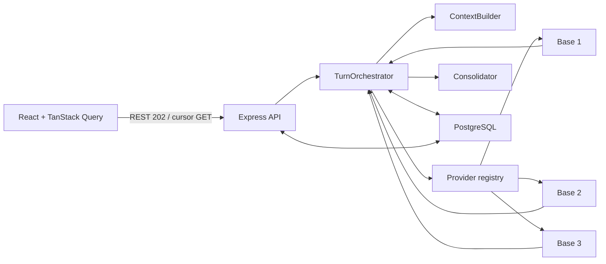

# Implementation Plan: Comparación y consolidación de respuestas LLM

**Branch**: `001-compare-llm-responses` | **Date**: 2026-07-24 | **Spec**: [spec.md](./spec.md)
**Input**: Feature specification from `specs/001-compare-llm-responses/spec.md`

## Summary

ModelFuse seguirá como monolito modular: React/Vite en `apps/frontend`,
Express/TypeScript en `apps/backend`, primitives Shadcn/Tailwind en `packages/ui`
y PostgreSQL gobernado por Liquibase. Cada prompt genera un turno con tres slots
base ejecutados en paralelo y un slot consolidador posterior.

La API REST persiste primero y responde `202`; TanStack Query v5 administra todo
el server state: listas, detalle, historial infinito por cursor, polling del turno
activo y mutaciones. Al abrir una conversación se consultan tres turnos completos;
un sentinel superior carga bloques anteriores sin paginación visible.

## Technical Context

**Language/Version**: Node.js >=22, TypeScript ~6, React 19.2, Express 5.2  
**Primary Dependencies**: Vite 8, `@tanstack/react-query` v5, Shadcn UI 4,
Tailwind CSS 4, Axios, Zod 4, `pg`, Pino, pnpm 11 y Turborepo
**Storage**: PostgreSQL 16; Liquibase 4.30 con SQL formateado
**Testing**: Vitest 4, Testing Library, Supertest y Playwright
**Target Platform**: Navegadores modernos y Node.js en Linux/contenedores
**Project Type**: Aplicación web en monorepo, monolito modular
**Performance Goals**: `202` en menos de 1 segundo; estados terminales en menos
de 60 segundos en 95% de consultas disponibles; primer bloque de historial en
menos de 1 segundo bajo carga de un usuario
**Constraints**: Cuatro slots fijos; bloque de historial de tres turnos; contexto
LLM acotado; secretos y contenido fuera de logs
**Scale/Scope**: Primera versión privada para un usuario; cursores opacos y una
conversación visible a la vez

## Constitution Check

*GATE: Must pass before Phase 0 research. Re-checked after Phase 1 design.*

- [x] Ownership permanece en `apps/frontend`, `apps/backend`, `packages/ui` y
      `db`, sin imports cruzados entre aplicaciones.
- [x] `index.ts` arranca/detiene; `app.ts` configura; rutas, controllers,
      middleware, services e infrastructure conservan límites explícitos.
- [x] Los adapters LLM normalizan proveedor/modelo antes de orquestación.
- [x] PostgreSQL es fuente de verdad y los cuatro historiales lógicos están
      aislados.
- [x] TanStack Query vive en frontend; `packages/ui` solo contiene primitives.
- [x] Todo esquema se entrega como SQL formateado incluido por XML de módulo.
- [x] Zod valida HTTP y entorno; claves, prompts y respuestas no se registran.
- [x] El plan cubre unitarias, integración, migraciones y E2E.
- [x] Las tareas pueden asignarse a owners FE, BE, UI, DB y TEST.
- [x] No existen violaciones que requieran excepción.

**Gate result before research**: PASS  
**Gate result after design**: PASS

## Project Structure

```text
specs/001-compare-llm-responses/
├── plan.md
├── research.md
├── data-model.md
├── quickstart.md
├── contracts/
│   ├── rest-api.md
│   └── llm-provider.md
└── tasks.md

apps/
├── frontend/
│   ├── e2e/
│   └── src/
│       ├── components/layout/
│       ├── providers/query-provider.tsx
│       └── features/conversations/
│           ├── api/
│           ├── components/
│           ├── hooks/
│           ├── queries/conversation-keys.ts
│           ├── schemas/
│           ├── types/
│           └── __tests__/
└── backend/src/
    ├── controllers/conversations/
    ├── routes/conversations/
    ├── middleware/validation/
    ├── services/conversations/
    ├── services/llm/
    ├── infrastructure/config/
    ├── infrastructure/llm/providers/
    ├── infrastructure/postgres/repositories/
    ├── types/
    └── utils/

packages/ui/src/components/

db/changelogs/
├── conversations/
├── messages/
└── db.changelog-master.xml
```

**Structure Decision**: Se reutilizan los workspaces actuales. TanStack Query se
añade solo a frontend; no se crea un paquete de estado ni un workspace de
contratos sin un segundo consumidor.

## Architecture



Una conversación persistida contiene turnos; cada turno contiene un prompt y
cuatro respuestas por slot. Los contextos se reconstruyen por slot, no con cuatro
filas de conversación:

- cada base usa prompts previos y solo sus propias respuestas;
- el consolidador usa prompts/respuestas consolidadas previas y las respuestas
  base nuevas del turno actual;
- nunca recibe historiales base completos.

### Turn lifecycle

1. La mutación envía `clientRequestId` y prompt.
2. Una transacción crea turno y cuatro slots `pending`.
3. La API devuelve `202`.
4. `Promise.allSettled` ejecuta los tres base y persiste cada resultado.
5. El consolidador usa las respuestas disponibles y persiste su resultado.
6. `useQuery` consulta el turno activo cada segundo hasta estado terminal.
7. Retry modifica solo el slot fallido; si es base, recalcula consolidación.

La ejecución inicial vive en Node y el estado durable en PostgreSQL. Una cola se
añade solo al adoptar multiinstancia o reintentos durables. SSE/WebSocket se
difiere hasta que streaming o carga haga insuficiente el polling.

## REST API

Contrato detallado: [contracts/rest-api.md](./contracts/rest-api.md).

| Method | Path | Purpose |
|---|---|---|
| `POST` | `/api/v1/conversations` | Crear conversación y primer turno (`202`) |
| `GET` | `/api/v1/conversations?limit&cursor` | Sidebar por cursor |
| `GET` | `/api/v1/conversations/:id` | Metadatos, sin historial |
| `PATCH` | `/api/v1/conversations/:id` | Renombrar |
| `DELETE` | `/api/v1/conversations/:id` | Eliminar en cascade |
| `GET` | `/api/v1/conversations/:id/turns?limit=3&before` | Bloque más reciente o anterior |
| `POST` | `/api/v1/conversations/:id/turns` | Crear turno (`202`) |
| `GET` | `/api/v1/conversations/:id/turns/:turnId` | Estado/respuestas para polling |
| `POST` | `/api/v1/conversations/:id/turns/:turnId/responses/:slot/retry` | Retry de slot |

El cursor de turnos es Base64URL opaco de `{ordinal,id}`. Sin `before`, el
repositorio ejecuta orden descendente con `LIMIT 3`, invierte el resultado para
devolver orden cronológico y emite `olderCursor`. Con cursor aplica
`(ordinal,id) < (...)`. El límite default es 3 y máximo 20; nunca pagina mensajes
sueltos.

“Limpiar” es estado local: deselecciona la conversación y abre un borrador. No hay
endpoint ni conversación vacía persistida.

## Frontend Design

`App.tsx` monta `QueryProvider`, `AppShell` y `ConversationWorkspace`; no contiene
layout ni reglas de datos.

### Components

- `ConversationSidebar`, `ConversationListItem`, `ConversationMenu`.
- `RenameConversationDialog` y `DeleteConversationDialog`.
- `ConversationView`, `TurnList`, `HistoryTopSentinel`, `PromptComposer`.
- `ResponseTabs` y `ResponsePanel` para tres bases y consolidador.

`Tabs`, `Dialog`, `DropdownMenu`, `ScrollArea` y `Skeleton` faltantes se añaden a
`packages/ui` con `pnpm dlx shadcn@latest add <component> -c apps/frontend`.
Componentes que conocen conversaciones permanecen en frontend.

### Server state vs local state

| TanStack Query | React local state |
|---|---|
| Lista de conversaciones | `activeConversationId` |
| Metadatos de conversación | Borrador no persistido |
| Páginas de turnos | Tab seleccionado por turno |
| Estado del turno activo | Estado abierto/cerrado de dialogs |
| Resultados de create/retry/rename/delete | Texto del composer antes de submit |

No se copia server state a `useState`.

### Query keys

```ts
conversationKeys.all
conversationKeys.lists()
conversationKeys.list({ limit })
conversationKeys.detail(conversationId)
conversationKeys.turns(conversationId)
conversationKeys.turn(conversationId, turnId)
```

Las keys son arrays estables y centralizados; objetos de filtros solo contienen
valores serializables.

### Query mapping

- `useInfiniteQuery(list)`: sidebar con cursor por `updatedAt,id`.
- `useQuery(detail)`: título/timestamps; no incluye turnos.
- `useInfiniteQuery(turns)`: `initialPageParam: null`,
  `getPreviousPageParam: firstPage.olderCursor`; cada página contiene hasta tres
  turnos completos.
- `useQuery(turn)`: polling con `refetchInterval` de 1000 ms mientras el estado no
  sea terminal y `false` después.
- `useMutation`: create conversation, create turn, retry, rename y delete.

### Upward infinite history

`IntersectionObserver` observa un sentinel superior y llama
`fetchPreviousPage()` cuando `hasPreviousPage`. Antes de fetch se captura
`scrollHeight`; después de anteponer se suma la diferencia a `scrollTop`, evitando
saltos. Las páginas se aplanan en orden cronológico. No hay botones ni números.

No se usa `maxPages` en v1 porque al cargar hacia atrás puede expulsar el tramo
reciente y romper la continuidad. Solo una conversación mantiene historial
caliente: `gcTime` corto para historiales inactivos y `removeQueries` al cambiar de
conversación liberan páginas anteriores. Si un perfil real muestra presión dentro
de una única conversación, se añadirá virtualización y paginación bidireccional.

### Cache updates and invalidation

| Mutation/event | Cache action |
|---|---|
| Create conversation | Seed detail/turn/history con respuesta; invalidate lists |
| Create turn | Append al bloque reciente; seed active turn; invalidate lists |
| Poll response | `setQueryData(turn)` y reemplazar el mismo turno en infinite data |
| Terminal turn | Stop polling; invalidate list y detail |
| Retry slot | Patch turn/history con respuesta `pending`; polling resumes |
| Rename | Patch detail y list pages; invalidate lists in background |
| Delete | `cancelQueries`, remove detail/turns/turn keys, invalidate lists |

Las mutaciones esperan respuesta del servidor antes de escribir cache; no se añade
optimistic rollback complejo. Axios recibe `AbortSignal` desde los query functions
y Zod valida todas las respuestas.

## Backend Design

- `index.ts`: startup/recovery, `listen` y shutdown; `gracefulShutdown` sale de
  `app.ts`.
- `app.ts`: middleware global, `apiRouter`, invalid routes y error handler.
- `routes/conversations`: rutas y validación.
- `controllers/conversations`: HTTP únicamente.
- `ConversationService`: CRUD y cursores de conversaciones/turnos.
- `TurnOrchestrator`: base → consolidación, retry y estados.
- `ContextBuilder`: aislamiento y presupuesto.
- `infrastructure/postgres/repositories`: SQL/transactions concretos.
- `infrastructure/llm/providers`: adapters y registry por slot.
- `infrastructure/config`: Zod para ambiente, modelos y credenciales.
- `types`: contratos REST/LLM; `utils`: funciones puras.

El contrato de adapter está en
[contracts/llm-provider.md](./contracts/llm-provider.md). Normaliza `content`,
`provider`, `model`, timestamps, usage y metadata; nunca expone SDK types.

## Context Strategy

`ContextBuilder` usa `LLM_CONTEXT_MAX_TURNS=10` y presupuesto por modelo:

1. system prompt y prompt actual;
2. pares recientes hasta límite de turnos/tokens;
3. orden cronológico;
4. para base, solo respuestas del mismo slot;
5. para consolidador, solo historial consolidado más bases del turno actual.

Se registran `includedTurns`, estimación de tokens y `contextTruncated`, nunca
contenido. Una futura compresión viviría en `services/llm/ContextSummaryService`
y se persistiría por slot solo si calidad/truncamiento justifican el costo.

## Database and Liquibase

Modelo: [data-model.md](./data-model.md).

- `conversations`: id, título, timestamps; cursor `(updated_at,id)`.
- `turns`: prompt, ordinal, idempotencia, estado; cursor `(ordinal,id)`.
- `model_responses`: cuatro slots, proveedor/modelo, contenido/error, usage y
  metadata JSONB.

```text
db/changelogs/
├── conversations/
│   ├── db.changelog-conversations.xml
│   ├── 001-create-conversations.sql
│   └── 002-create-turns.sql
├── messages/
│   ├── db.changelog-messages.xml
│   ├── 001-create-model-responses.sql
│   └── 002-add-response-indexes.sql
└── db.changelog-master.xml
```

Los XML se incluyen explícitamente desde master. Todo SQL es Liquibase formatted
con changeset único y rollback seguro. No se crea módulo `metrics`: usage JSONB
cubre v1; el módulo aparece cuando una feature analítica lo requiera.

## Testing and Quality

| Level | Minimum coverage |
|---|---|
| Backend unit | Cursor encode/decode, ContextBuilder, estados y mappers |
| Backend integration | bloques 3/3, límites/cursor inválido, CRUD, retry, polling resource |
| Frontend unit/integration | query keys, infinite flatten/prepend, scroll anchor, polling stop, cache patch/invalidation |
| Migration | validate, fresh update, constraints/cascades e índices |
| E2E | conversación/consolidación; reapertura 3 turnos + scroll; rename/delete/retry |

Vitest/Testing Library usan un `QueryClient` nuevo por test con retries
desactivados. Supertest prueba `createApp()` y adapters fake deterministas.
Playwright usa backend/test DB reales sin proveedores pagados.

## Specialized Agent Assignment

| Domain | Executor | Reviewer |
|---|---|---|
| Frontend, TanStack Query y UI | `frontend-builder` | `frontend-auditor` |
| Shared primitives | `frontend-builder` | `frontend-auditor` |
| API, orchestration y adapters | `backend-builder` | `backend-auditor` |
| PostgreSQL/Liquibase | `backend-builder` | `backend-auditor` |
| Unit tests | `unit-test-runner` | auditor del dominio |
| Integration/E2E | builder del dominio | auditor del dominio |

Las tareas full-stack se dividen por dominio y terminan con una tarea explícita de
integración. Auditors permanecen read-only.

## Observability and Future Extension

Pino registra `requestId`, conversación, turno, slot, proveedor/modelo, duración,
estado, cursor page size y usage conocido; excluye contenido, claves y cadenas de
conexión. TanStack Query puede observarse con Devtools solo en desarrollo si se
necesita depuración, no como dependencia de producción.

Los IDs permiten añadir OpenTelemetry si aparece distribución real. Usage/metadata
admiten tokens/costo y ranking. Nuevos modelos usan adapters. Streaming puede
reemplazar únicamente el query de polling por SSE/WebSocket sin alterar
persistencia, keys de historial ni contratos de conversación.

## Complexity Tracking

No hay violaciones constitucionales.
