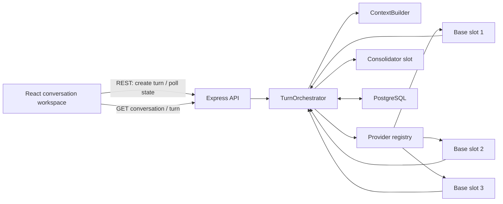

# Implementation Plan: Comparación y consolidación de respuestas LLM

**Branch**: `001-compare-llm-responses` | **Date**: 2026-07-24 | **Spec**: [spec.md](./spec.md)  
**Input**: Feature specification from `specs/001-compare-llm-responses/spec.md`

## Summary

ModelFuse se implementará como un monolito modular dentro del monorepo existente:
React/Vite en `apps/frontend`, Express/TypeScript en `apps/backend`, componentes
Shadcn/Tailwind agnósticos en `packages/ui` y PostgreSQL gobernado por Liquibase.

Cada prompt crea un turno persistido con cuatro slots de respuesta. El backend
ejecuta los tres slots base en paralelo, persiste cada resultado y después llama al
consolidador con su historial propio y las respuestas nuevas disponibles. La API
REST devuelve `202 Accepted`; el frontend consulta el turno mientras haya slots no
terminales. No se añaden WebSockets, SSE, una cola externa ni un framework de
estado remoto para la primera versión.

## Technical Context

**Language/Version**: Node.js >=22, TypeScript ~6, React 19.2, Express 5.2  
**Primary Dependencies**: Vite 8, Shadcn UI 4, Tailwind CSS 4, Axios, Zod 4,
`pg`, Pino; pnpm 11 y Turborepo  
**Storage**: PostgreSQL 16; Liquibase 4.30 con SQL formateado  
**Testing**: Vitest 4, Testing Library, Supertest; Playwright para los flujos E2E
críticos  
**Target Platform**: Navegadores modernos y backend Node.js desplegable en
Linux/contenedores  
**Project Type**: Aplicación web en monorepo, monolito modular  
**Performance Goals**: `202` en menos de 1 segundo bajo carga de un usuario; los
cuatro slots alcanzan un estado terminal dentro de 60 segundos en al menos 95% de
las consultas con proveedores disponibles  
**Constraints**: Cuatro slots fijos por turno; secretos solo en entorno; contexto
acotado por turnos y presupuesto; ningún prompt o respuesta en logs  
**Scale/Scope**: Primera versión privada para un usuario, tres modelos base y un
consolidador; historial paginado por cursor

## Constitution Check

*GATE: Must pass before Phase 0 research. Re-checked after Phase 1 design.*

- [x] Las rutas reales permanecen en `apps/frontend`, `apps/backend`,
      `packages/ui` y `db`; no hay imports entre aplicaciones.
- [x] `index.ts` conserva arranque/parada; `app.ts` configura Express; rutas,
      controllers, middleware, services e infrastructure tienen responsabilidades
      separadas.
- [x] Los proveedores implementan un contrato común y el consolidador consume
      respuestas normalizadas.
- [x] PostgreSQL es la fuente de verdad y los cuatro contextos lógicos permanecen
      aislados.
- [x] Los primitives reutilizables viven en `packages/ui`; los componentes de
      producto permanecen en frontend.
- [x] Todo esquema se entrega como SQL formateado e incluido desde changelogs XML
      de módulo.
- [x] Zod valida configuración y fronteras HTTP; secretos y contenido no se
      registran.
- [x] El plan incluye unitarias, integración, validación de migraciones y E2E para
      los recorridos críticos.
- [x] Cada área puede asignarse a frontend, backend, UI/DB y testing sin propiedad
      ambigua.
- [x] No existen violaciones que requieran Complexity Tracking.

**Gate result before research**: PASS  
**Gate result after design**: PASS

## Project Structure

### Documentation (this feature)

```text
specs/001-compare-llm-responses/
├── plan.md
├── research.md
├── data-model.md
├── quickstart.md
├── contracts/
│   ├── rest-api.md
│   └── llm-provider.md
└── tasks.md                 # generado posteriormente por /speckit-tasks
```

### Source Code (repository root)

```text
apps/
├── frontend/
│   ├── e2e/
│   └── src/
│       ├── components/layout/
│       └── features/conversations/
│           ├── api/
│           ├── components/
│           ├── hooks/
│           ├── schemas/
│           ├── types/
│           └── __tests__/
└── backend/
    └── src/
        ├── controllers/conversations/
        ├── routes/conversations/
        ├── middleware/validation/
        ├── services/conversations/
        ├── services/llm/
        ├── infrastructure/config/
        ├── infrastructure/llm/providers/
        ├── infrastructure/postgres/repositories/
        ├── types/
        └── utils/
packages/
└── ui/src/components/
db/
└── changelogs/
    ├── conversations/
    ├── messages/
    └── db.changelog-master.xml
```

**Structure Decision**: Se conserva el monorepo y el monolito modular actuales.
No se crea un cuarto workspace ni un paquete de contratos hasta que exista un
segundo consumidor fuera de estas dos aplicaciones.

## Architecture



Una conversación de producto es un solo agregado persistido, no cuatro filas de
conversación. Cada turno contiene un prompt y cuatro respuestas identificadas por
slot (`base-1`, `base-2`, `base-3`, `consolidator`). Las cuatro conversaciones
lógicas se reconstruyen por slot:

- cada slot base combina los prompts previos con sus propias respuestas;
- el consolidador combina prompts previos con respuestas consolidadas previas y
  añade únicamente las respuestas base nuevas del turno actual;
- el consolidador nunca recibe los historiales completos de los slots base.

### Request lifecycle

1. El frontend envía `clientRequestId` y prompt.
2. Una transacción crea conversación/turno y cuatro slots `pending`.
3. La API devuelve `202` inmediatamente con el turno persistido.
4. `TurnOrchestrator` ejecuta los tres adapters base con `Promise.allSettled` y
   persiste cada slot al terminar.
5. Con las respuestas disponibles crea el contexto del consolidador y ejecuta su
   adapter.
6. El frontend consulta el turno usando `Retry-After: 1` hasta que todos los slots
   sean terminales.
7. Un retry cambia solo el slot fallido. Si es base, la consolidación se vuelve a
   ejecutar para no conservar un resultado obsoleto.

La ejecución vive en el proceso Node, pero todo estado durable vive en PostgreSQL.
Al arrancar, el backend marca como `failed/interrupted` los slots `running` que
superen el umbral configurado. Una cola durable se añadirá únicamente cuando haya
múltiples instancias, reintentos automáticos o necesidad de supervivencia exacta a
reinicios.

## REST API

Base path: `/api/v1`. El contrato detallado está en
[contracts/rest-api.md](./contracts/rest-api.md).

| Method | Path | Purpose |
|---|---|---|
| `POST` | `/conversations` | Crear conversación con su primer prompt y devolver `202` |
| `GET` | `/conversations` | Listar resúmenes por cursor, más recientes primero |
| `GET` | `/conversations/:conversationId` | Recuperar conversación y turnos |
| `PATCH` | `/conversations/:conversationId` | Renombrar con título de 1–80 caracteres |
| `DELETE` | `/conversations/:conversationId` | Eliminar conversación y datos relacionados |
| `POST` | `/conversations/:conversationId/turns` | Crear el siguiente turno y devolver `202` |
| `GET` | `/conversations/:conversationId/turns/:turnId` | Consultar estados y respuestas del turno |
| `POST` | `/conversations/:conversationId/turns/:turnId/responses/:slot/retry` | Reintentar un slot fallido |

La consolidación inicial forma parte del envío del turno, por lo que no se crea un
endpoint redundante. “Limpiar” tampoco muta el servidor: el frontend deselecciona
la conversación y abre un borrador local; la nueva conversación se persiste solo
con el primer prompt, como exige FR-019.

Todas las escrituras validan Zod, devuelven errores con `{code, message,
requestId}`, y usan `clientRequestId` para hacer idempotente el envío. Un segundo
turno mientras el anterior siga activo devuelve `409 TURN_IN_PROGRESS`.

## Frontend Design

`App.tsx` será un orquestador ligero que monta `AppShell` y
`ConversationWorkspace`; no contendrá layout ni lógica de negocio.

### Application-owned components

- `AppShell`: layout de sidebar y área principal.
- `ConversationWorkspace`: selección activa, borrador nuevo y coordinación de
  lista/detalle.
- `ConversationSidebar` y `ConversationListItem`: historial paginado y selección.
- `ConversationMenu`: menú de tres puntos con renombrar/eliminar.
- `RenameConversationDialog`: input controlado, máximo 80, confirmación/cancelar.
- `DeleteConversationDialog`: confirmación destructiva y foco accesible.
- `ConversationView`, `TurnList` y `PromptComposer`: recorrido de chat.
- `ResponseTabs` y `ResponsePanel`: cuatro tabs con etiqueta textual, estado,
  contenido y retry.

### Shared primitives

`Button`, `Input`, `Textarea`, `Label`, `Separator` y `Sonner` ya existen en
`packages/ui`. Si faltan, `Tabs`, `Dialog`, `DropdownMenu`, `ScrollArea` y
`Skeleton` se añaden mediante
`pnpm dlx shadcn@latest add <component> -c apps/frontend`; solo esos primitives
viven en `packages/ui`. Ninguno conoce conversaciones, rutas ni APIs.

### State and data flow

- React state guarda `activeConversationId`, el borrador y estados visuales.
- Axios llama a la API; Zod valida cada respuesta antes de entrar a la UI.
- Hooks pequeños (`useConversationList`, `useConversation`,
  `useSubmitTurn`) encapsulan carga, polling y `AbortController`.
- No se añade TanStack Query: polling de un único turno y revalidación explícita
  caben en hooks existentes.
- Al cambiar de conversación se cancela el polling visible; el backend continúa
  y la conversación se recarga desde PostgreSQL al volver.
- El composer se deshabilita mientras exista un turno activo. Cada tab muestra
  `pending`, `running`, `completed` o `failed` sin depender solo del color.

## Backend Design

- `index.ts`: arranque, recuperación de ejecuciones interrumpidas, `listen` y
  graceful shutdown. `gracefulShutdown` se mueve fuera de `app.ts`.
- `app.ts`: crea Express, registra middleware global, monta `apiRouter` antes de
  rutas inválidas y error global; no abre puertos.
- `routes/conversations`: paths y middleware de validación.
- `controllers/conversations`: adaptación `req/res`, códigos HTTP y delegación.
- `services/conversations/ConversationService`: crear, listar, cargar, renombrar y
  eliminar agregados.
- `services/llm/TurnOrchestrator`: secuencia base → consolidación, estados, retries
  y cancelación best-effort al eliminar.
- `services/llm/ContextBuilder`: única política de ventana y aislamiento.
- `infrastructure/llm/providers`: adapters concretos y registro por slot.
- `infrastructure/postgres/repositories`: funciones SQL concretas y transacciones;
  no se crea una interfaz de repositorio con una sola implementación.
- `infrastructure/config`: Zod valida entorno y mapea los cuatro slots a
  proveedor/modelo.
- `types`: contratos REST, conversación y LLM compartidos dentro del backend.
- `utils`: solo funciones puras transversales; no contiene reglas de negocio.

El contrato del adapter está en [contracts/llm-provider.md](./contracts/llm-provider.md).
Normaliza `content`, `provider`, `model`, timestamps, `usage` y `metadata`. Las
credenciales se resuelven en infrastructure; nunca viajan al controller ni al
frontend.

## Context Strategy

`ContextBuilder` aplica una ventana por slot, con `LLM_CONTEXT_MAX_TURNS=10` como
valor inicial configurable y un presupuesto por modelo que reserva tokens de
salida.

1. Incluye system prompt y prompt actual.
2. Recorre pares históricos desde el más reciente hasta alcanzar el máximo de
   turnos o el presupuesto estimado.
3. Devuelve los mensajes seleccionados en orden cronológico.
4. Para base usa solo respuestas anteriores del mismo slot.
5. Para consolidación usa solo prompts/respuestas consolidadas previas y añade las
   respuestas base del turno actual.

La estimación inicial usa conteo reportado por el adapter cuando esté disponible y
una aproximación conservadora por caracteres en los demás casos; no se añade una
librería de tokenización por proveedor. Se registran `includedTurns`,
`estimatedInputTokens` y `contextTruncated`, nunca el contenido.

La ventana acotada satisface la primera versión. Si la tasa de truncamiento o las
pruebas de calidad lo justifican, se añadirá un `ContextSummaryService` en
`services/llm`, llamado por `ContextBuilder`, y un resumen persistido por slot. No
se crea ese servicio ni su tabla de forma especulativa.

## Database and Liquibase

El modelo normalizado se detalla en [data-model.md](./data-model.md):

- `conversations`: identidad, título y timestamps;
- `turns`: prompt único, ordinal, idempotencia y estado;
- `model_responses`: cuatro filas por turno, slot, proveedor/modelo, contenido,
  error, timestamps y `usage/metadata` JSONB.

Migraciones:

```text
db/changelogs/
├── conversations/
│   ├── db.changelog-conversations.xml
│   ├── 001-create-conversations.sql
│   └── 002-create-turns.sql
├── messages/
│   ├── db.changelog-messages.xml
│   ├── 001-create-model-responses.sql
│   └── 002-add-response-indexes.sql
└── db.changelog-master.xml
```

Los dos XML de módulo se incluyen explícitamente desde el master con
`relativeToChangelogFile="true"`. Cada SQL empieza con
`--liquibase formatted sql`, usa changesets únicos e incluye rollback cuando sea
seguro. No se crea todavía un módulo `metrics`: `usage` y `metadata` cubren el
contrato actual; un futuro esquema analítico tendrá
`metrics/db.changelog-metrics.xml` cuando una feature lo necesite.

## Testing and Quality

| Level | Scope | Tool and location |
|---|---|---|
| Unit | ContextBuilder, estados, mappers, validación, hooks y dialogs | Vitest; `__tests__` adyacentes |
| Backend integration | REST, transacciones, cascada, idempotencia, retry | Supertest + PostgreSQL de prueba en `apps/backend/src/**/__tests__` |
| Frontend integration | tabs, polling, sidebar y modales con API simulada | Testing Library + Vitest |
| Migration | `validate`, `update` limpio y rollback verificable | Contenedor Liquibase/PostgreSQL |
| E2E | crear/enviar/consolidar; reabrir/continuar; renombrar/eliminar | Playwright en `apps/frontend/e2e` |

Los adapters LLM de tests son deterministas y no hacen red. El
`unit-test-runner` escribe solo unitarias; backend-builder y frontend-builder
implementan integración/E2E de su dominio, revisadas por los auditors
correspondientes. Cada test verifica intención observable, no clases CSS ni
detalles privados.

## Specialized Agent Assignment

| Domain | Primary executor | Reviewer | Typical work |
|---|---|---|---|
| Frontend | `frontend-builder` | `frontend-auditor` | workspace, hooks, tabs, sidebar, dialogs, polling |
| Shared UI | `frontend-builder` | `frontend-auditor` | añadir/exportar primitives agnósticos |
| Backend/API | `backend-builder` | `backend-auditor` | routes, controllers, services, adapters, config |
| PostgreSQL/Liquibase | `backend-builder` | `backend-auditor` | repositories, SQL y changelog wiring |
| Unit tests | `unit-test-runner` | auditor del dominio | pruebas aisladas y deterministas |
| Integration/E2E | builder del dominio | auditor del dominio | fronteras reales y journeys |

Las tareas futuras deben tener un solo tag de dominio. Un recorrido full-stack se
divide en FE, BE, DB/TEST y una tarea final de integración; los auditors permanecen
read-only.

## Observability and Future Extension

Pino emitirá logs estructurados con `requestId`, `conversationId`, `turnId`,
`slot`, proveedor/modelo, duración, estado, error code y usage conocido. Prompts,
respuestas, claves y cadenas de conexión quedan excluidos.

Los mismos identificadores se propagan en respuestas HTTP y llamadas internas.
No se añade OpenTelemetry en v1; esos campos permiten incorporarlo si aparecen
múltiples procesos o servicios. `usage`/`metadata` admiten tokens, costo y
latencias; ranking o scoring puede consumir las respuestas normalizadas sin
cambiar tablas centrales ni adapters. Nuevos modelos se añaden mediante adapter y
configuración de slot, sin reescribir la conversación.

## Complexity Tracking

No hay violaciones constitucionales ni complejidad que requiera excepción.
