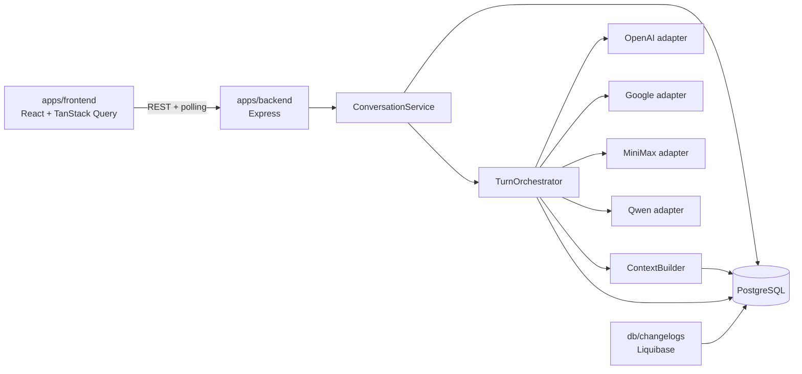

# Implementation Plan: Comparación y consolidación de respuestas LLM

**Branch**: `001-compare-llm-responses` | **Date**: 2026-07-26 | **Spec**: [spec.md](./spec.md)
**Input**: `specs/001-compare-llm-responses/spec.md` más las decisiones cerradas
de v1 proporcionadas para concurrencia, idempotencia, retry y UI.

## Summary

ModelFuse se implementará como monolito modular dentro del monorepo pnpm:
React/Vite en `apps/frontend`, Express/TypeScript en `apps/backend`, primitivas
Shadcn reutilizables en `packages/ui` y PostgreSQL administrado exclusivamente
por Liquibase.

Un prompt crea idempotentemente una conversación y un turno persistidos, inicia
en paralelo OpenAI, Google y MiniMax y usa Qwen para consolidar las respuestas
base disponibles. El frontend recibe `202 Accepted`, consulta el turno mediante
polling y muestra cuatro tabs independientes.

Cada conversación admite un único turno con trabajo en curso. Existe trabajo en
curso si cualquier turno o slot de esa conversación está `pending` o `running`.
Mientras exista, backend rechaza nuevos turnos de esa conversación y la UI
deshabilita Enviar y todos sus retries, muestra un indicador de procesamiento y
permite navegar a otras conversaciones. Al quedar todos los turnos/slots en
estado terminal, Enviar y los retries válidos se reactivan incluso si el resultado
es `failed` o `partial`.

Ante la primera falla recuperable se muestran inmediatamente Retry y
Continue-without, sin retry automático. Si todavía hay otro trabajo activo, Retry
se muestra deshabilitado por la regla anterior; Continue-without permanece
disponible porque persiste una decisión y no invoca proveedores.

## Technical Context

**Language/Version**: TypeScript 6, Node.js 22+, React 19
**Primary Dependencies**: Express 5, React/Vite 8, Axios, Zod, TanStack Query v5,
Shadcn UI/Tailwind, `pg`, Pino
**Storage**: PostgreSQL 16 con Liquibase 4.30 y changelogs SQL formateados
**Testing**: Vitest, React Testing Library, Supertest y Playwright
**Target Platform**: navegador moderno y servidor Node.js en entorno privado
monousuario
**Project Type**: aplicación web en monorepo pnpm, monolito modular
**Performance Goals**: con providers fake y PostgreSQL local controlado,
`POST /api/v1/conversations` y el primer bloque de historial responden en menos de
un segundo en al menos el 95% de las ejecuciones del conjunto de aceptación;
al menos el 95% de las consultas alcanza estados terminales en 60 segundos
**Constraints**: REST con polling; un turno activo por conversación; creación
idempotente con `clientRequestId`; retry LLM exclusivamente manual; contexto
acotado por turnos sin presupuesto de tokens por modelo; PostgreSQL como fuente
de verdad
**Scale/Scope**: un usuario privado, cuatro slots predefinidos, conversación
multiturno, sidebar e historial de chat con scroll infinito

Todas las decisiones necesarias están cerradas; no hay preguntas pendientes.

## Constitution Check

*GATE: Must pass before Phase 0 research. Re-check after Phase 1 design.*

- [x] `apps/frontend`, `apps/backend`, `packages/ui` y `db` conservan ownership
      independiente.
- [x] `index.ts` solo inicia/detiene; `app.ts` compone Express; routes,
      controllers, middleware, services e infrastructure mantienen una
      responsabilidad.
- [x] Los cuatro providers tienen adapters separados y un contrato interno
      normalizado.
- [x] PostgreSQL es la fuente de verdad; contexto e historial respetan aislamiento
      y una ventana explícita.
- [x] Primitivas reutilizables viven en `packages/ui`; reglas de busy,
      idempotencia, polling y cache viven en las aplicaciones.
- [x] Esquema, constraints e índices se entregan mediante módulos Liquibase.
- [x] Credenciales y contenido sensible quedan fuera de frontend, metadata y logs.
- [x] Concurrencia, replay idempotente, retry y recovery tienen pruebas
      deterministas de integración.
- [x] Las tareas futuras pueden dividirse por frontend, backend, DB y testing.
- [x] No hay excepciones constitucionales.

**Post-design re-check**: PASS. Los artefactos de Phase 1 implementan las reglas
cerradas sin añadir bloqueos globales, retries automáticos ni presupuestos de
tokens.

## Architecture



### New conversation lifecycle

1. Frontend genera un UUID con `crypto.randomUUID()` para el submit lógico y lo
   envía como `clientRequestId`.
2. `POST /conversations` busca primero una conversación con ese
   `create_client_request_id`. Si existe, devuelve la conversación y el primer
   turno originales sin insertar ni invocar providers otra vez; si el prompt no
   coincide, devuelve `409 CLIENT_REQUEST_ID_CONFLICT`.
3. Si no existe, una transacción crea conversación, primer turno y cuatro slots.
   El constraint único resuelve dos requests simultáneos con el mismo ID haciendo
   que ambos obtengan el mismo recurso.
4. Backend responde `202` sin esperar proveedores y el orquestador procesa el
   turno.

### Existing conversation lifecycle

1. `POST /conversations/:id/turns` bloquea brevemente la fila de conversación
   dentro de la transacción.
2. Busca primero `(conversation_id, client_request_id)`. Un replay devuelve el
   turno original aunque ese turno siga procesándose; reutilizar el ID con otro
   prompt devuelve `409 CLIENT_REQUEST_ID_CONFLICT`.
3. Para una solicitud nueva comprueba si existe cualquier turno o slot
   `pending`/`running`. Si existe, devuelve `409 CONVERSATION_BUSY`.
4. Si no existe, asigna el siguiente ordinal, crea turno/cuatro slots y responde
   `202`.
5. El lock termina al confirmar la creación; nunca se mantiene durante llamadas
   LLM y no afecta a otras conversaciones.

### Turn execution

1. `TurnOrchestrator` invoca en paralelo los tres slots base con
   `Promise.allSettled`.
2. Cada resultado se normaliza y persiste inmediatamente en la conversación y
   turno de origen.
3. Cada invocación de adapter es un único intento. Una falla no genera retry
   automático.
4. Qwen recibe su historial consolidado acotado, el prompt actual y las respuestas
   base disponibles del turno actual.
5. El turno permanece `running` mientras cualquier slot esté `pending`/`running`.
   Cuando todos son terminales se recalcula como `completed`, `partial` o `failed`
   y `hasWorkInProgress` pasa a `false`.

### Retry and continue-without

- Una primera falla recuperable queda `failed` y proyecta de inmediato las
  acciones Retry y Continue-without.
- La UI deshabilita Retry mientras cualquier turno/slot de esa conversación esté
  `pending`/`running`. Cuando no haya trabajo, los retries válidos se habilitan.
- Backend solo acepta retry de un slot `failed` y recuperable. La transición
  condicional `failed → pending` garantiza que dos requests de retry sobre el
  mismo slot no se ejecuten simultáneamente.
- Si otra unidad de trabajo activa pertenece a un turno distinto de aquel que se
  reintenta, backend devuelve `409 CONVERSATION_BUSY`; un retry no puede crear un
  segundo turno activo.
- Si el slot ya está `pending`/`running`, backend devuelve
  `409 RESPONSE_RETRY_IN_PROGRESS`.
- Un retry base fallido no llama Qwen y conserva la mejor consolidación válida.
- Un retry base exitoso marca la consolidación previa como stale y ejecuta una
  nueva consolidación Qwen.
- Un retry Qwen no ejecuta providers base.
- Continue-without solo aplica a un slot base `failed`, persiste la ausencia y no
  llama providers. No constituye trabajo en curso.

### Navigation

Busy es por conversación, no global. Cambiar la selección no cancela ni reasigna
trabajo: resultados tardíos se guardan por `conversationId` y `turnId` de origen.
La UI de otra conversación calcula su propio `hasWorkInProgress`.

### Startup recovery

`server.ts`, antes de `listen()`, reconcilia slots persistidos `pending`/`running`
como interrupciones terminales y recalcula sus turnos. Esto libera correctamente
el busy de la conversación cuando ya no quedan estados activos. Recovery no
relanza providers. `index.ts` solo invoca start/stop.

## Concurrency and Idempotency Invariants

1. Una conversación tiene como máximo un turno con status `pending` o `running`.
2. Si un slot está `pending`/`running`, su turno también está `running`; los
   cambios de ambos estados ocurren en la misma transacción.
3. `hasWorkInProgress` es verdadero si existe cualquier turno o slot
   `pending`/`running`; la consulta revisa ambos para no ocultar un estado
   inconsistente recuperable.
4. `conversations.create_client_request_id` es único globalmente.
5. `turns (conversation_id, client_request_id)` es único por conversación.
6. Un replay idempotente se resuelve antes del chequeo busy y no reinicia
   orquestación.
7. Un `clientRequestId` identifica un único submit lógico; frontend genera uno
   nuevo solo cuando el usuario inicia un submit nuevo.
8. Retry no reutiliza `clientRequestId`: su exclusión se garantiza mediante la
   transición atómica del mismo slot.
9. Cada slot incrementa `attempt_no` al iniciar una ejecución y solo persiste un
   resultado si sigue correspondiendo a ese número; una respuesta tardía no puede
   sobrescribir una ejecución posterior.

## Context Composition

`ContextBuilder`, dentro de `apps/backend/src/services/conversations`, consulta una
ventana configurable de turnos recientes relevantes.

- OpenAI, Google y MiniMax: prompts y respuestas completadas del mismo slot,
  seguidos del prompt actual.
- Qwen: prompts y consolidaciones Qwen previas vigentes, prompt actual y solo las
  respuestas base disponibles del turno actual.
- Qwen nunca recibe historiales previos de OpenAI, Google ni MiniMax.
- PostgreSQL conserva el historial completo.
- La ventana se expresa en turnos y no crea presupuesto, estimación ni límite de
  tokens diferente por modelo.

Cada respuesta persiste únicamente evidencia segura:

```json
{
  "contextWindow": {
    "truncated": true,
    "firstIncludedOrdinal": 8,
    "lastIncludedOrdinal": 15
  }
}
```

No se persiste el prompt compuesto, una copia del contexto ni contenido adicional.
La API proyecta esta evidencia y la UI muestra un aviso textual cuando
`truncated=true`.

## Frontend Design

### Layout and components

`App` instala `QueryClientProvider` y monta `AppShell`:

- `ConversationSidebar`: listado con `useInfiniteQuery`, sentinel inferior,
  autofill, fecha y menú de tres puntos.
- `ConversationWorkspace`: conversación seleccionada o draft vacío.
- `ConversationProcessingNotice`: aviso textual visible cuando
  `hasWorkInProgress=true`.
- `ConversationTimeline`: páginas de turnos completos, sentinel superior y ancla
  visual estable.
- `TurnCard` y `ResponseTabs`: prompt y cuatro respuestas/estados identificados.
- `ResponsePanel`: contenido, error, ausencia, stale, acciones de retry/continue y
  aviso de contexto acotado.
- `MessageComposer`: prompt y botón Enviar.

### Busy behavior

`ConversationDetail.hasWorkInProgress` es la fuente de la UI:

- Enviar está deshabilitado si el prompt es whitespace, la mutación local sigue
  pendiente o `hasWorkInProgress=true`.
- Todos los botones Retry de la conversación están deshabilitados si
  `hasWorkInProgress=true`.
- El indicador explica que la conversación procesa un turno y no acepta nuevas
  acciones que emitan trabajo.
- Continue-without permanece habilitado para un slot base fallido porque no emite
  trabajo.
- Al pasar busy a `false`, Enviar y los retries aplicables se recalculan desde el
  estado terminal, incluidos `failed` y `partial`.
- La primera falla muestra las dos acciones de inmediato aunque Retry aparezca
  temporalmente deshabilitado por otro slot activo.

### Idempotent mutations

- Frontend genera `clientRequestId` una vez por submit lógico con
  `crypto.randomUUID()`.
- El mismo ID permanece en las variables de la mutación hasta obtener respuesta;
  cualquier repetición HTTP del mismo submit usa ese ID.
- Los botones también se deshabilitan durante su mutación local para evitar doble
  click antes de recibir la proyección busy.
- Un nuevo click autorizado después de terminar genera otro ID.

### Server state and history

TanStack Query administra listado/detalle, historial infinito, polling, create,
turn create, rename, delete, retry y continue-without. Resultados y mutaciones
actualizan claves por IDs de origen.

La carga inicial del chat solicita hasta tres turnos completos y antepone bloques
anteriores mediante sentinel superior. El sidebar carga hacia abajo y sigue
solicitando mientras no llene su contenedor. Tabs, dialogs y expansión de mensajes
son estado local.

El colapso histórico usa `VITE_HISTORY_COLLAPSE_CHAR_THRESHOLD` y no realiza
requests ni escrituras.

### Shared UI ownership

`packages/ui` contiene solo primitivas Shadcn agnósticas (`Tabs`, `Dialog`,
`DropdownMenu`, `ScrollArea`, `Skeleton`, `Alert`). `apps/frontend` contiene la
composición de busy, conversación, providers, queries y formularios.

## Backend Design

### Layers

- `index.ts`: llama start/stop.
- `server.ts`: valida configuración, compone dependencias, ejecuta recovery y
  abre/cierra el servidor.
- `app.ts`: configura Express y exporta `createApp()`.
- `routes/conversations`: paths y controllers.
- `controllers/conversations`: traducción HTTP.
- `services/conversations`: `ConversationService`, `TurnOrchestrator`,
  `ContextBuilder`, busy/idempotencia, retry y recovery.
- `infrastructure/postgres`: pool, repositories, locks y transacciones.
- `infrastructure/llm`: contrato, adapters separados y registro literal de slots.
- `types`: contratos HTTP/LLM.
- `utils`: cursores y helpers puros de título/estado.

### REST surface

| Method | Path | Purpose |
|---|---|---|
| `POST` | `/api/v1/conversations` | Crear/reproyectar conversación idempotente; `202` |
| `GET` | `/api/v1/conversations` | Página del sidebar |
| `GET` | `/api/v1/conversations/:id` | Detalle con `hasWorkInProgress` |
| `PATCH` | `/api/v1/conversations/:id` | Renombrar |
| `DELETE` | `/api/v1/conversations/:id` | Eliminar en cascade |
| `GET` | `/api/v1/conversations/:id/turns` | Bloque de hasta tres turnos |
| `POST` | `/api/v1/conversations/:id/turns` | Crear/reproyectar turno idempotente; `202` o busy |
| `GET` | `/api/v1/conversations/:id/turns/:turnId` | Polling |
| `POST` | `/api/v1/conversations/:id/turns/:turnId/responses/:slot/retry` | Retry manual atómico |
| `POST` | `/api/v1/conversations/:id/turns/:turnId/responses/:slot/continue-without` | Persistir ausencia |

### Provider abstraction

Cada adapter acepta mensajes normalizados y devuelve contenido, provider, model,
timestamps, métricas opcionales y metadata segura. Ejecuta exactamente un request
externo por `generate()`. Errores de autenticación, rate limit, conectividad,
timeout, contenido bloqueado o respuesta inválida se normalizan por slot sin
bodies, headers ni secretos.

## Persistence and Liquibase

PostgreSQL contiene:

- `conversations`: ID, `create_client_request_id`, título y timestamps;
- `turns`: conversation ID, `client_request_id`, ordinal, prompt, estado y
  timestamps;
- `model_responses`: slot, rol, provider/model, estado, contenido/error,
  recoverability, continue-without, stale, número de intento, metadata y
  timestamps.

Constraints/indices clave:

- `UNIQUE (conversations.create_client_request_id)`;
- `UNIQUE (turns.conversation_id, turns.client_request_id)`;
- `UNIQUE (turns.conversation_id, turns.ordinal)`;
- índice único parcial de un turno activo por conversación:
  `UNIQUE (conversation_id) WHERE status IN ('pending','running')`;
- `UNIQUE (model_responses.turn_id, model_responses.slot)`;
- índice parcial de slots `pending`/`running` para busy/recovery.

Migraciones:

```text
db/changelogs/
├── db.changelog-master.xml
├── conversations/
│   ├── db.changelog-conversations.xml
│   └── 001-create-conversations-and-turns.sql
└── messages/
    ├── db.changelog-messages.xml
    └── 001-create-model-responses.sql
```

No se crean tablas de idempotencia, locks, contexto, métricas, evaluaciones,
ranking, retries ni versiones de respuesta.

## Testing and Quality

### Backend unit

- título determinista y cursores;
- cálculo `hasWorkInProgress` con turno o slot `pending`/`running`;
- aislamiento/context window/evidencia sin contenido sensible;
- una invocación por adapter ante falla recuperable;
- retry base exitoso/fallido, retry Qwen y continue-without;
- cálculo de estado terminal.

### Backend integration

- creación atómica y replay concurrente de `POST /conversations` con el mismo
  `clientRequestId`: un solo recurso y una sola ejecución;
- replay de `POST /conversations/:id/turns` devuelve el turno original;
- dos IDs nuevos simultáneos en una conversación: solo uno crea turno y el otro
  recibe `409 CONVERSATION_BUSY`;
- un turno/slot activo hace busy; `failed`/`partial` sin slots activos lo libera;
- dos retries simultáneos del mismo slot: solo uno transiciona a `pending`;
- retry de un turno antiguo mientras otro turno está activo devuelve busy;
- resultado tardío de un intento anterior no sobrescribe el intento vigente;
- retry base fallido no llama Qwen; exitoso marca stale y reconsolida;
- historial, sidebar, rename, delete y continue-without;
- recovery recreando aplicación/servicios sobre la misma DB y verificando orden,
  atribución, estados y consulta en el 100% de casos del conjunto de recuperación;
- SC-010 con providers fake: ambos endpoints debajo de un segundo en al menos el
  95% de las ejecuciones controladas.

### Frontend

- Enviar y Retry deshabilitados durante busy;
- indicador de procesamiento y reactivación en `failed`/`partial` terminal;
- primera falla muestra retry/continue inmediatamente; retry puede estar disabled
  por busy y continue permanece disponible;
- `clientRequestId` estable por submit/replay y nuevo para el siguiente submit;
- polling/cache por IDs de origen;
- cuatro tabs, scroll infinito, dialogs y colapso histórico;
- aviso de contexto truncado sin exponer contenido.

### E2E

- crear, comparar y consolidar;
- doble submit/replay no duplica conversación/turno;
- busy impide nuevo turno y deshabilita Enviar/Retry solo en esa conversación;
- navegación a otra conversación durante procesamiento;
- primera falla, continue-without y retry manual;
- retry base exitoso reconsolida; retry fallido no invoca Qwen;
- follow-up con aislamiento de contexto;
- reapertura/historial/sidebar/rename/delete/nuevo draft.

SC-005 mantiene un fixture versionado de máximo cinco casos y al menos 90% de
checks simples. No introduce ranking general.

## Observability and Extension

Pino registra IDs técnicos, slot/provider/model, duración, estado, busy,
idempotent replay, recovery y paginación. No registra prompts, respuestas,
credenciales, headers ni payloads externos.

El contrato LLM conserva una extensión opcional para métricas informadas por
providers, pero v1 no las estima ni persiste. Nuevos adapters, ranking, métricas
persistentes, trazas o colas requieren un spec posterior.

## Project Structure

### Documentation

```text
specs/001-compare-llm-responses/
├── plan.md
├── research.md
├── data-model.md
├── quickstart.md
├── consolidation-evaluation.md
├── contracts/
│   ├── rest-api.md
│   └── llm-provider.md
└── tasks.md              # no modificado por este comando
```

### Source Code

```text
apps/
├── frontend/src/
│   ├── api/
│   ├── components/
│   ├── features/conversations/
│   ├── hooks/
│   ├── providers/
│   ├── types/
│   └── test/
└── backend/src/
    ├── controllers/conversations/
    ├── routes/conversations/
    ├── middleware/
    ├── services/conversations/
    ├── infrastructure/
    │   ├── llm/
    │   └── postgres/
    ├── types/
    ├── utils/
    ├── app.ts
    ├── server.ts
    └── index.ts
packages/ui/src/components/
db/changelogs/
├── db.changelog-master.xml
├── conversations/
└── messages/
```

**Structure Decision**: conservar el monolito modular existente. Los nuevos
directorios corresponden a responsabilidades constitucionales presentes; no se
crea otro workspace.

## Complexity Tracking

No hay violaciones constitucionales ni complejidad excepcional que justificar.
